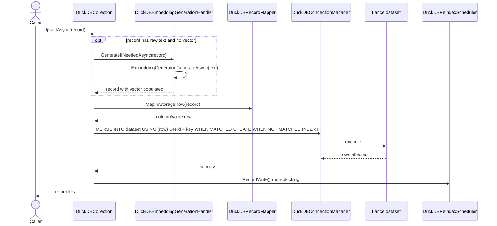
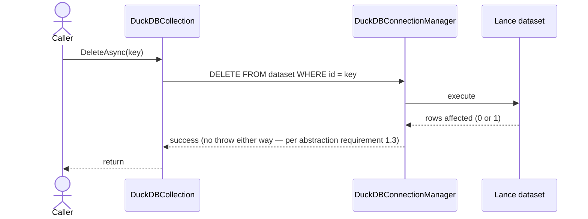
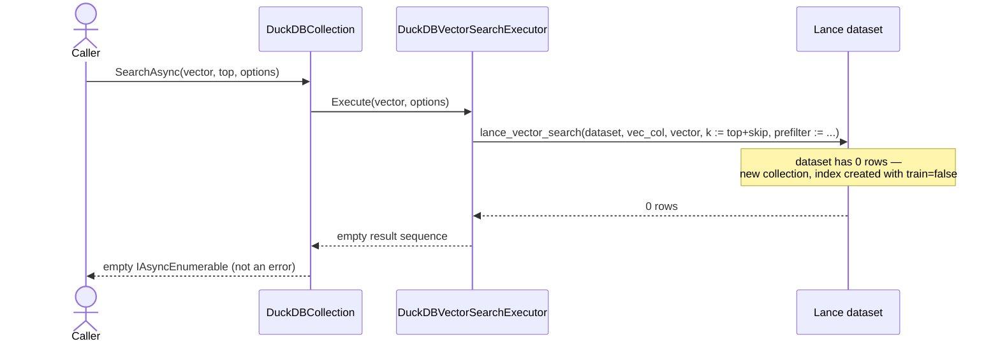
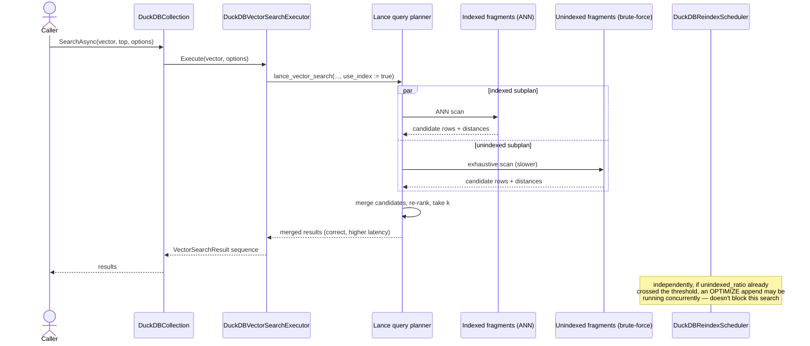

# Technical Design Spec: Microsoft.SemanticKernel.Connectors.DuckDB

| | |
|---|---|
| **Status** | Draft |
| **Target framework** | .NET 10 |
| **Package name** | `Microsoft.SemanticKernel.Connectors.DuckDB` |
| **Depends on** | `Microsoft.Extensions.VectorData.Abstractions` |
| **Test framework** | TUnit (unit + integration tests by default) |

## Table of Contents

1. [Summary](#1-summary)
2. [Goals](#2-goals)
3. [Non-Goals](#3-non-goals)
4. [Background](#4-background)
5. [Architecture Overview](#5-architecture-overview)
6. [Components](#6-components)
7. [Dependencies](#7-dependencies)
8. [Detailed Design](#8-detailed-design)
   - 8.1 [Data model & schema](#81-data-model--schema)
   - 8.2 [Vector property types](#82-vector-property-types)
   - 8.3 [Embedding generation](#83-embedding-generation)
   - 8.4 [Indexing](#84-indexing)
   - 8.5 [Filtering](#85-filtering)
   - 8.6 [Search](#86-search)
   - 8.7 [Collection lifecycle](#87-collection-lifecycle)
   - 8.8 [Exceptions](#88-exceptions)
   - 8.9 [Reindexing (background scheduler)](#89-reindexing-background-scheduler)
9. [Sequence Diagrams](#9-sequence-diagrams)
10. [BDD Scenarios](#10-bdd-scenarios)
11. [Known Limitations](#11-known-limitations)
12. [Testing Strategy](#12-testing-strategy)
13. [Implementation Plan (Build Order)](#13-implementation-plan-build-order)
14. [References](#14-references)
15. [Validation Required Before Implementation](#15-validation-required-before-implementation)
16. [Design Decision Log](#16-design-decision-log)

## 1. Summary

A `VectorStore` connector implementing `Microsoft.Extensions.VectorData.Abstractions`, backed by DuckDB's `lance` core extension for storage, indexing, vector search, full-text search, and hybrid search. The goal is a connector that meets the abstraction's official [build-your-own-connector requirements](https://learn.microsoft.com/en-us/semantic-kernel/concepts/vector-store-connectors/how-to/build-your-own-connector) end to end.

The connector has the following characteristics, in the same format Microsoft's own out-of-the-box connector docs use (e.g. the [Postgres connector page](https://learn.microsoft.com/en-us/semantic-kernel/concepts/vector-store-connectors/out-of-the-box-connectors/postgres-connector)):

| Feature Area | Support |
|---|---|
| Collection maps to | A table in one shared attached Lance namespace per store (§5) |
| Supported key property types | `string` only (§3 — deliberately narrower than most connectors) |
| Supported data property types | Expected to match DuckDB/Arrow's native type system (bool, integer widths, float/double, decimal, string, DateTime/DateTimeOffset, byte[], and `List<T>`/array enumerables of these) — this is the target for `DuckDBSchemaBuilder` (§8.1); not yet exhaustively verified per-type the way the vector/index/filter surfaces have been |
| Supported vector property types | `ReadOnlyMemory<float>`, `Embedding<float>`, `float[]` (§8.2) |
| Supported index types | `IvfFlat`, `QuantizedFlat`, `Hnsw`, `Dynamic` (defaults to quantized `IVF_PQ` — §8.4). `DiskAnn` not supported |
| Supported distance functions | `CosineDistance`, `DotProductSimilarity`, `EuclideanDistance` (Lance's `cosine`/`dot`/`l2` — §8.6; note `l2` is *squared* Euclidean, confirmed empirically) |
| Supported filter clauses | `EqualTo`, `AnyTagEqualTo` — expressed as LINQ (`r => r.Prop == value`, `r => r.Tags.Contains(value)`), not the obsolete fluent API (§8.5) |
| Supports multiple vectors in a record | Yes — confirmed empirically (§8.6, Decision Log #8) |
| IsIndexed supported? | Yes |
| IsFullTextIndexed supported? | Yes (drives hybrid search's text-property selection, §8.6) |
| StorageName supported? | Yes |
| HybridSearch supported? | Yes (§8.6, §8.9) |

## 2. Goals

- Full CRUD (single + batch) over a Lance-backed collection, addressed via DuckDB SQL.
- Vector search and hybrid (vector + keyword) search, both with `Top`/`Skip` paging.
- Filtering on two LINQ shapes: property equality and list/tag containment.
- Automatic embedding generation from raw text via `IEmbeddingGenerator`, alongside precomputed-vector input.
- Index creation covering the full range of vector index types Lance supports (including quantized variants) and scalar/tag indexes.
- Conformance with the abstraction's standard exception types, generic-data-model support, and batching requirements.

## 3. Non-Goals

- Key types other than `string`.
- Composite (multi-column) indexes — not supported by the underlying Lance extension at all, regardless of connector design.
- A standalone "keyword-only" search API — the abstraction only exposes vector search and hybrid (vector+keyword) search as first-class interfaces; pure BM25-only search would be a connector-specific extra, out of scope unless explicitly requested later.
- Arbitrary `OrderBy` in hybrid/vector search — the abstraction has no such option; see §11 Known Limitations.
- Lance's versioning/checkout/restore/tag features (time-travel, rollback). Versions still accumulate automatically as an inherent property of Lance's MVCC (§8.8's concurrent-write note) and get cleaned up via `VACUUM LANCE`'s retention window (§8.9) regardless — this non-goal is specifically about not adding connector API surface (`RestoreAsync` or similar) on top of what already exists underneath. Revisit only if a real rollback/audit use case shows up later.

## 4. Background

DuckDB's own vector extensions (`vss` for HNSW, `fts` for BM25) have two production-readiness gaps: `vss`'s HNSW index is explicitly experimental for on-disk/persistent databases (WAL recovery isn't implemented for custom indexes), and `fts` indexes don't auto-update on writes. DuckDB's `lance` core extension (shipped in collaboration with LanceDB as of DuckDB 1.5.1) sidesteps both — Lance manages its own on-disk vector/scalar/text indexes independently of DuckDB's WAL, and exposes native vector search, FTS, and hybrid search as SQL table functions. This spec uses Lance as the storage/indexing layer, queried and mutated through DuckDB SQL.

## 5. Architecture Overview

- **Storage:** each collection is backed by a Lance dataset, and CRUD always goes through an `ATTACH`ed namespace — confirmed there's no raw-path form for `INSERT`/`UPDATE`/`DELETE`/`MERGE INTO`, only for index DDL (`CREATE INDEX`, etc.), which targets a dataset path directly regardless. **Single mode, no toggle:** one `ATTACH '{StoragePath}' AS <alias> (TYPE LANCE)` done once per store, every collection a table (`{StoreKey}_{collectionName}`) within it. An earlier draft had a second mode (a separate `ATTACH`ed subdirectory per collection, for isolation) — dropped, because the isolation it bought wasn't real: `DROP TABLE {alias}.main.{name}` in a shared namespace is exactly as clean a per-collection deletion, and nothing meaningful is actually isolated by separate attaches within one process's one DuckDB session anyway. Dropping it also eliminates an entire validation question that mattered only for the multi-attach mode (§15 — whether many simultaneous `ATTACH`es cause overhead), since there's now always exactly one. `StoreKey` (default `"vs"`) still matters here — it's what lets multiple logical `DuckDBVectorStore` instances safely share one `StoragePath` without their tables colliding. **This mechanism is reasoned from the extension's documented SQL semantics, not yet run against a live DuckDB session — see §15.**

- **Multi-tenancy is an application-level pattern, not a connector feature** — no special machinery needed, same as most SQL-based connectors (Postgres/Sqlite work identically: one connection, tables for collections, tenancy is the caller's concern). Three mechanisms already in this design compose into the usual options: full isolation → one `DuckDBVectorStore` per tenant (distinct `StoragePath` and/or `StoreKey` each); collection-level separation without separate stores → a naming convention encoding the tenant into the collection name itself (e.g. `docs_tenant42`, becoming its own table); row-level separation within one shared collection → a tenant-id property on each record, scoped via the equality filter shape (§8.5) at query time.
- **Core types:**
  - `DuckDBVectorStore : VectorStore`
  - `DuckDBCollection<TKey, TRecord> : VectorStoreCollection<TKey, TRecord>`, implementing `IVectorSearchable<TRecord>` and `IKeywordHybridSearchable<TRecord>`
  - Both `sealed`; customization goes through the decorator pattern, not inheritance (per the abstraction's recommended patterns).
  - `DuckDBCollection<TKey, TRecord>`'s constructor is `internal` — not constructible directly, only via `DuckDBVectorStore.GetCollection<TKey,TRecord>(string name, VectorStoreCollectionDefinition? definition = null)`, the standard abstract signature with no DuckDB-specific overload added on top. Every configuration knob (embedding generator, reindex tuning, storage mode) lives on `DuckDBVectorStoreOptions` — the store owns it all, no separate `DuckDBCollectionOptions<TRecord>` class exists. Diverges from Qdrant/Postgres/Sqlite, which all support direct collection construction with their own options — a deliberate trade of that convenience for eliminating the cross-instance scheduler-coordination problem entirely (§8.9) rather than working around it with reference-counted static state.
- **Fallback dependency (not required for current scope):** `LanceDB` NuGet ([lennylxx/lancedb-csharp](https://github.com/lennylxx/lancedb-csharp), unofficial, v2.4.0, wraps the official Rust `lancedb` crate via P/Invoke). Every index type and filter primitive this spec needs is confirmed creatable through the DuckDB extension directly, so this isn't load-bearing — keep it as a documented escape hatch for richer rerankers (`RRFReranker`/`LinearCombinationReranker`/`MRRReranker`) or anything else the DuckDB SQL surface doesn't expose. Its native builds cover **Linux x64, Windows x64, macOS arm64 only** — narrower than DuckDB.NET's own platform support — so anything routed through it inherits that ceiling.
- **Platform support, confirmed from DuckDB's own official docs:** the `lance` extension itself supports **`linux_amd64`, `linux_arm64`, `osx_arm64`, `windows_amd64`** — no macOS x64 (Intel). Combined with lancedb-csharp's own gap above, **Intel Mac has no supported path through either the primary or fallback dependency** — worth stating explicitly as a platform limitation, not discovering it at a user's bug report.

See §6 for the full per-namespace component inventory realizing this architecture.

## 6. Components

`DuckDBCollection` is intentionally thin — it delegates to the components below rather than doing schema handling, filter translation, index management, and search execution inline. This keeps each concern independently testable (see §12).

### `Microsoft.SemanticKernel.Connectors.DuckDB` (public surface)

| Component | Responsibility |
|---|---|
| `DuckDBVectorStore` | Top-level `VectorStore`. `GetCollection<TKey,TRecord>()` factory — constructs and returns without existence checks (per abstraction requirement 1.2). Owns extension bootstrap (`INSTALL lance; LOAD lance;`). Owns a registry of `DuckDBReindexScheduler` instances keyed by dataset identity (§8.9): a scheduler is created once, on first need, and lives for as long as the store does — no eviction logic, no expiry, it just goes away when the store itself does. Since `DuckDBCollection`'s constructor is `internal`, `GetCollection` is the only path to a collection, so every scheduler is guaranteed to register here. |
| `DuckDBVectorStoreOptions` | The sole configuration surface — no separate collection-level options class exists. `StoragePath` (base directory, `ATTACH`ed once as a shared namespace — see §5) plus `StoreKey` (string, default `"vs"`) — prefixes every table name (§5), so multiple logical stores can safely share one `StoragePath` without colliding. `EmbeddingGenerator` (nullable) — applies to every collection; no per-collection override (per-property/record-definition overrides still work for free via the abstraction's own `VectorStoreCollectionDefinition`/`VectorStoreVectorProperty`, passed through the standard `GetCollection(name, definition)` call — see §8.3). `ExtensionPath` (nullable string) — load a local pre-downloaded `.duckdb_extension` file instead of relying on network `INSTALL`; needed for air-gapped/locked-down networks, since `INSTALL lance` failed outright in this project's own sandbox when `extensions.duckdb.org` wasn't reachable. Extension presence is always checked and installed/loaded automatically on store construction — no opt-out toggle for this. `ReindexOptions` (`DuckDBReindexOptions`) — single set of reindex tuning shared by every collection's scheduler; see §8.9. |
| `DuckDBCollection<TKey, TRecord>` | Sealed `VectorStoreCollection<TKey, TRecord>`. Constructor is `internal` — only reachable via `DuckDBVectorStore.GetCollection`. Implements `IVectorSearchable<TRecord>`, `IKeywordHybridSearchable<TRecord>`. Delegates to the components below; owns no business logic itself beyond orchestration. |

### Dependency injection (public surface)

Mirrors the confirmed convention across Qdrant/Sqlite/Azure AI Search exactly — two overloads per registration target (self-construct vs. resolve-from-DI), plus a matching `IKernelBuilder` set. No per-collection DI extension (`AddDuckDBCollection<TKey,TRecord>`) — checked, none of the three reference connectors have one either; the standard pattern is registering the store and calling `GetCollection` where needed, which this design already supports.

| Method | Purpose |
|---|---|
| `DuckDBServiceCollectionExtensions.AddDuckDBVectorStore(IServiceCollection, DuckDBVectorStoreOptions options, string? serviceId = null)` | Self-managed: constructs its own `Kurrent.Quack`-backed connection pool from `options.StoragePath`. |
| `DuckDBServiceCollectionExtensions.AddDuckDBVectorStore(IServiceCollection, string? serviceId = null)` | DI-resolved: expects a `Kurrent.Quack` pool/provider already registered in DI. Exact parameter shape depends on `Kurrent.Quack`'s own public types — not fully specified here. |
| `DuckDBKernelBuilderExtensions.AddDuckDBVectorStore(IKernelBuilder, DuckDBVectorStoreOptions options, string? serviceId = null)` | `Kernel.CreateBuilder()` equivalent of the self-managed overload. |
| `DuckDBKernelBuilderExtensions.AddDuckDBVectorStore(IKernelBuilder, string? serviceId = null)` | `Kernel.CreateBuilder()` equivalent of the DI-resolved overload. |

### `Microsoft.SemanticKernel.Connectors.DuckDB.Schema` (§8.1, §8.2)

| Component | Responsibility |
|---|---|
| `DuckDBModelReader` | Reads `[VectorStoreKey]`/`[VectorStoreData]`/`[VectorStoreVector]` via reflection, or consumes a supplied `VectorStoreCollectionDefinition` as sole source of truth. |
| `DuckDBPropertyModel` | Internal per-property representation (CLR name, storage name, CLR type, `IsIndexed`, `IsFullTextIndexed`, vector dimension) — consumed by the mapper, filter translator, and index builder. |
| `DuckDBSchemaValidator` | Validates vector dimension against `[VectorStoreVector(dim)]`, supported vector CLR types, and `string`-only key type, at collection construction (fail early). Also validates `StoreKey` and collection names against Lance's own naming rule (confirmed from LanceDB's namespace docs): non-empty, letters/numbers/underscores/hyphens/periods only — since the resolved `{StoreKey}_{collectionName}` identifier (§5) must itself be a valid Lance namespace/table name. |
| `DuckDBSchemaBuilder` | Translates `DuckDBPropertyModel`s into DuckDB column definitions (`FLOAT[dim]` arrays, etc.) for `CREATE TABLE`/`COPY ... (FORMAT lance)`. |

### `Microsoft.SemanticKernel.Connectors.DuckDB.Mapping` (§8.1)

| Component | Responsibility |
|---|---|
| `IDuckDBRecordMapper<TRecord>` | Internal mapping abstraction: storage row ⇄ `TRecord`. |
| `DuckDBRecordMapper<TRecord>` | Default POCO mapper, built from `DuckDBPropertyModel`s. |
| `DuckDBGenericDataModelMapper<TKey>` | Maps `VectorStoreGenericDataModel<TKey>`; auto-selected when the caller requests the generic model (per abstraction requirement 8). |

### `Microsoft.SemanticKernel.Connectors.DuckDB.Filtering` (§8.5)

| Component | Responsibility |
|---|---|
| `DuckDBFilterTranslator` | Visits `Expression<Func<TRecord,bool>>`; supports exactly two shapes (equality, `.Contains()`); throws `NotSupportedException` for any other node type. |
| `DuckDBFilterResult` | Holds the translated SQL predicate fragment plus whether it's prefilter-pushdown-eligible (equality always is; `.Contains()` only is when a `LABEL_LIST` index exists on the target column). |

### `Microsoft.SemanticKernel.Connectors.DuckDB.Indexing` (§8.4, §8.9)

| Component | Responsibility |
|---|---|
| `DuckDBIndexKindMapper` | Maps `IndexKind` → Lance `USING` type + default build params (§8.4's table). Throws `NotSupportedException` for `DiskAnn`. |
| `DuckDBIndexBuilder` | Issues `CREATE INDEX ... USING <type> WITH (...)`, including `train=false` deferred creation at collection-creation time. |
| `DuckDBReindexScheduler` | Background scheduler (§8.9): one timer per dataset drives three live-queried checks each tick — index freshness (`SHOW INDEXES`/`COUNT(*)` → `unindexed_ratio` → `ALTER INDEX ... OPTIMIZE`), compaction (`OPTIMIZE 'dataset' WITH (materialize_deletions:=true)`, confirmed empirically to be a separate operation from index freshness), and a time-based retrain check against a single stored last-retrain timestamp. No write-path hooks, no running counters. Backs the public `OptimizeIndexesAsync()`. One instance per unique dataset identity, registered on `DuckDBVectorStore` the first time it's needed and shared across every `GetCollection` call for that dataset thereafter — not one per `DuckDBCollection` instance. Lives as long as the store does. Always runs; not optional. |
| `DuckDBReindexOptions` | Threshold percentage, absolute unindexed-row floor, timer interval, retrain cadence (default: 24h) — surfaced via `DuckDBVectorStoreOptions.ReindexOptions`, shared by every collection. No counters — every trigger decision is a live query on each tick, except retrain, which needs one stored last-retrain timestamp (§8.9 flags a possible way to make even that live-queried, pending verification). Optional `ILoggerFactory?` (default `null`, no-op) for scheduler diagnostics — not a constructor dependency; no MEVD connector (Postgres/Qdrant/Sqlite) takes `ILogger` in its constructor, so this stays opt-in via options to match that convention rather than forcing a DI container on every consumer. |

### `Microsoft.SemanticKernel.Connectors.DuckDB.Search` (§8.6)

| Component | Responsibility |
|---|---|
| `DuckDBVectorSearchExecutor` | Builds/executes `lance_vector_search` calls; vector-property auto-selection; `IncludeVectors`; simulates `Skip` when unsupported natively. |
| `DuckDBHybridSearchExecutor` | Builds/executes `lance_hybrid_search` calls; `AdditionalProperty` auto-selection. |
| `DuckDBScoreConverter` | Converts `_distance` to MEVD's higher-is-better `Score`: `1 - _distance` for `cosine`/`dot`, `1 / (1 + _distance)` for `l2` (§8.6). |

### `Microsoft.SemanticKernel.Connectors.DuckDB.Storage` (§8.7)

| Component | Responsibility |
|---|---|
| `DuckDBDatasetResolver` | Collection name → attached-namespace table name (`{StoreKey}_{collectionName}`) — there's no raw-path CRUD form (§5). Owns the single `ATTACH '{StoragePath}'` call, done once per store. Also resolves the raw dataset path used for index DDL (`CREATE INDEX`/`SHOW INDEXES`/etc.), which bypasses `ATTACH` entirely. |
| `DuckDBConnectionManager` | Wraps `DuckDB.NET`'s `DuckDBConnection`; extension bootstrap. Connection pooling and thread-safe concurrent access within one process are handled by `Kurrent.Quack` (§7) — an existing internal component, not designed from scratch here. Still internally wraps DuckDB.NET's synchronous calls in `Task.Run` — DuckDB.NET has no genuine async I/O (neither does DuckDB core), so this is standard sync-wrapping, not true asynchrony; cancellation is cooperative only. |
| `DuckDBCollectionLifecycleManager` | `EnsureCollectionExistsAsync`/`CollectionExistsAsync`/`EnsureCollectionDeletedAsync` implementation, delegated to from `DuckDBCollection`. |

### `Microsoft.SemanticKernel.Connectors.DuckDB.Embeddings` (§8.3)

| Component | Responsibility |
|---|---|
| `DuckDBEmbeddingGenerationHandler` | Wraps `IEmbeddingGenerator` calls at upsert/search time — converts raw text into vectors before they reach the mapper or search executor. |

## 7. Dependencies

All versions below are **exact, pinned versions** — not floating/range versions — and this is policy for every dependency in this project, not just a default. `Microsoft.Extensions.VectorData.Abstractions` in particular has had breaking-ish changes before (the `VectorSearchFilter` obsolescence this spec itself had to correct for, §8.5) — a range would risk silently picking up a breaking change on restore.

| Package | Version | Purpose |
|---|---|---|
| `DuckDB.NET.Data.Full` | 1.5.3 | ADO.NET provider, includes native DuckDB library |
| `Microsoft.Extensions.VectorData.Abstractions` | 10.7.0 | Core abstractions being implemented |
| `Microsoft.Extensions.AI.Abstractions` | latest (pinned once resolved) | `IEmbeddingGenerator` support |
| `Kurrent.Quack` | latest (pinned once resolved) | Connection pooling and related connection-management concerns — an existing internal component (Kurrent), not something this connector designs itself. Resolves the connection-thread-safety question that would otherwise be open (§6, `DuckDBConnectionManager`). |
| `LanceDB` (optional) | 2.4.0 | Fallback only — see §5 |
| `TUnit` | latest (pinned once resolved) | Test framework — see §12 |

## 8. Detailed Design

### 8.1 Data model & schema

- Read `[VectorStoreKey]`, `[VectorStoreData]`, `[VectorStoreVector]` via reflection when no `VectorStoreCollectionDefinition` is supplied; treat a supplied definition as sole source of truth (no cross-validation against the CLR type).
- Support `IsIndexed` / `IsFullTextIndexed` per property, and `StorageName` overrides for custom column naming.
- Key type: `string` only.
- Validate vector array dimension against `[VectorStoreVector(dim)]` at collection construction — fail early, not on first write (per the abstraction's data-model-validation requirement).
- Ship two mappers: one for user POCOs, one for `VectorStoreGenericDataModel<TKey>`, the latter auto-selected when the user requests the generic model.

### 8.2 Vector property types

`ReadOnlyMemory<float>`, `Embedding<float>` (Microsoft.Extensions.AI), `float[]` — all map to a fixed-size DuckDB `ARRAY` column (`FLOAT[dim]`), required both for Lance's vector indexes and for `lance_vector_search`'s query-vector argument.

### 8.3 Embedding generation

Support `IEmbeddingGenerator` (Microsoft.Extensions.AI) so the collection accepts raw text and generates vectors itself at upsert and search time, in addition to accepting precomputed vectors directly.

Configurable at two levels, not the four other MEVD connectors support — no per-collection override exists here, since there's no `DuckDBCollectionOptions<TRecord>` class at all (§5):
- **Store-level** (`DuckDBVectorStoreOptions.EmbeddingGenerator`) — the default, and only connector-specific level. Applies to every collection.
- **Record-definition/property-level** — inherited for free from the abstraction itself (`VectorStoreCollectionDefinition.EmbeddingGenerator`, `VectorStoreVectorProperty.EmbeddingGenerator`), passed through the standard `GetCollection(name, definition)` call. The connector doesn't need to build anything extra for this level — it's not something a per-collection options class would have added on top of.

### 8.4 Indexing

Confirmed directly against the extension's source (`rust/ffi/index.rs`) — `CREATE INDEX ... USING <type> WITH (...)` on a Lance dataset path supports:

**Vector types** (all seven; `IndexKind` mapping):

| `IndexKind` | `USING` value |
|---|---|
| `Flat` | *(create no index — brute-force scan)* |
| `IvfFlat` | `IVF_FLAT` |
| `QuantizedFlat` | `IVF_PQ` |
| `Hnsw` | `IVF_HNSW_SQ` or `IVF_HNSW_PQ` (Lance has no standalone HNSW — always IVF partitions + HNSW sub-index) |
| `Dynamic` | `IVF_PQ` with Lance defaults — changed from unquantized `IVF_FLAT`; quantized indexing is the primary target usage (existing prototype relies on quantization) |
| `DiskAnn` | not supported by Lance → throw `NotSupportedException` |

Full type list: `IVF_FLAT`, `IVF_PQ`, `IVF_SQ`, `IVF_RQ`, `IVF_HNSW_FLAT`, `IVF_HNSW_PQ`, `IVF_HNSW_SQ`.

Build params (`WITH (...)`, JSON-encoded internally), with defaults:
- All: `metric_type` (default `l2`; also `cosine`, `dot`), `num_partitions` (default `256`), `version` (default `v3`)
- `IVF_PQ`: `num_bits` (8), `num_sub_vectors` (16), `max_iterations` (50)
- `IVF_SQ`: `num_bits` (8), `sample_rate` (256)
- `IVF_RQ`: `num_bits` (8 — confirmed from the DuckDB extension's own source, `index.rs`; note LanceDB's own SDK docs give a *different* default, `num_bits: 1`, for the same parameter on the same index type — see the flagged discrepancy below)
- `IVF_HNSW_*`: adds `hnsw_m`, `hnsw_ef_construction`, `hnsw_max_level`, `hnsw_prefetch_distance`, plus relevant PQ/SQ params for quantized variants

Example: `CREATE INDEX vec_idx ON 'dataset.lance' (vec) USING IVF_PQ WITH (metric_type='cosine', num_partitions=256, num_sub_vectors=16, num_bits=8);`

**Scalar types** (for `IsIndexed = true` properties): `BTREE`, `BITMAP`, `ZONEMAP`, `BLOOMFILTER`/`BLOOM_FILTER`, `INVERTED`, `NGRAM`/`N_GRAM`, `LABELLIST`/`LABEL_LIST`. Use `LABEL_LIST` for `List<string>`/array tag properties — it's purpose-built for the containment queries in §8.5. Fall back to `BTREE` for scalar equality properties.

**Constraint:** single-column indices only. This doesn't affect §8.5's filter shapes, since each clause targets exactly one property — combining clauses with `&&` means Lance intersects row-ids from separate single-column indexes rather than using one composite index. It would only matter for a genuinely composite/multi-column index requirement, which Lance can't build at all today, single- or multi-column.

**Parameter validation:** `IVF_PQ`/`IVF_HNSW_PQ`'s `num_sub_vectors` must evenly divide the vector dimension. Lance itself already rejects a bad combination with a clear message (confirmed empirically: `"dimension (10) must be divisible by num_sub_vectors (4)"`), but `DuckDBIndexBuilder` should still validate this and throw `ArgumentException` before issuing `CREATE INDEX` — fail before the round-trip, not because the underlying error is unclear.

**`IVF_RQ` is out of scope, deprioritized.** Quantized (`IVF_PQ`/`IVF_HNSW_PQ`) and unquantized (`IVF_FLAT`/`Flat`) are the priority, matching the existing prototype's usage — `IVF_RQ` was never actually reachable through the `IndexKind` mapping above anyway (no abstraction-level `IndexKind` value maps to it). It does have its own dimension constraint (divisible by 8, RaBitQ packs 1 bit/dimension) and an unresolved `num_bits` default discrepancy between the DuckDB extension's source (`8`) and LanceDB's SDK docs (`1`) — documented for completeness, but not something to resolve before implementation. If it ever causes friction, the answer is simply: don't support it.

### 8.5 Filtering

Filters are `Expression<Func<TRecord, bool>>` on `VectorSearchOptions<TRecord>.Filter` (current API, v10+) — **not** the obsolete `VectorSearchFilter.EqualTo`/`.AnyTagEqualTo` fluent API (preserved only as `.OldFilter`). Support two shapes:

| Shape | Example | Lance/DataFusion translation |
|---|---|---|
| Property equality | `r => r.Category == "x"` | `category = 'x'` |
| List/tag containment | `r => r.Tags.Contains("x")` | `array_has_any(tags, ['x'])` |

`array_has_any`/`array_has_all` are confirmed-supported DataFusion filter functions in current Lance (the older `array_contains` gap, [lance#1115](https://github.com/lance-format/lance/issues/1115), was closed via #1793) — both are prefilter-pushdown-eligible when a `LABEL_LIST` index exists on the column. Two clauses combine with `&&`. Only `IsIndexed = true` properties are filterable — reject or ignore filters on non-indexed properties, consistent with other connectors (per requirement 4.2 of the build guide).

**Note:** LanceDB's own client defaults pre-filtering to *on*; the DuckDB extension's search table functions default `prefilter` to `false`. Set it explicitly at the call site rather than relying on either default.

**Scope enforcement:** these two shapes are the entire supported surface. Any other expression node the LINQ visitor encounters — comparison operators (`>`, `<`, `!=`), `||`, unary `!`, nested member access, method calls other than `.Contains()`, etc. — throws `NotSupportedException` at translation time, before any SQL is issued. This is a hard boundary, not a best-effort fallback: an unsupported filter should never silently degrade to "no filter" or partial filtering.

### 8.6 Search

- `SearchAsync<TVector>` (via `lance_vector_search`): auto-select the vector property if only one exists; require `VectorPropertyName`/`VectorProperty` if there are multiple; throw if none exist. **Score conversion (resolved, empirically verified against Lance's Rust engine):** `lance_vector_search` returns `_distance`, but MEVD's `VectorSearchResult<TRecord>.Score` is documented as higher = more similar. Confirmed distance formulas per metric: `cosine` and `dot` both compute `1 - x` (cosine similarity or raw dot product respectively — same formula for both), `l2` computes **squared** Euclidean distance (not raw L2). Conversion: `Score = 1 - _distance` for `cosine`/`dot`; `Score = 1 / (1 + _distance)` for `l2` (bounded transform for the otherwise-unbounded squared distance).
- Respect `IncludeVectors` on `GetAsync` and `SearchAsync`.
- `Top`/`Skip`: if the query path doesn't support `Skip` natively, simulate per the abstraction's required pattern — fetch `Top + Skip`, discard the first `Skip` client-side.
- `IKeywordHybridSearchable<TRecord>.HybridSearchAsync` (via `lance_hybrid_search`): auto-select the single `IsFullTextIndexed` property if there's only one, otherwise require `AdditionalProperty`.
- Multiple `[VectorStoreVector]` properties on one model: confirmed empirically — independently-dimensioned, independently-indexed, independently-queried vector columns on the same dataset work with no surprises (tested with two columns of different dimensions, index types, and metrics simultaneously).

### 8.7 Collection lifecycle

- `GetCollection`: construct and return without existence checks.
- `EnsureCollectionExistsAsync` / `CollectionExistsAsync` / `EnsureCollectionDeletedAsync`: all go through the store's one attached namespace (§5) — there's no raw-path form for table creation/DML. `CREATE TABLE IF NOT EXISTS {alias}.main.{name}` / membership check / `DROP TABLE {alias}.main.{name}`. `DuckDBDatasetResolver` (§6) resolves the table name; `DuckDBCollectionLifecycleManager` just issues the statements.
- **Schema drift is the caller's responsibility, not the connector's.** If a table already exists and its actual columns don't match the current `VectorStoreCollectionDefinition`/CLR model, `EnsureCollectionExistsAsync` throws — no auto-migration attempt, even though DuckDB's `lance` extension does support `ALTER TABLE ADD/DROP/RETYPE COLUMN` and auto-migration would be technically possible. Explicit decision: the connector doesn't guess at reconciling drift on the caller's behalf.
- `GetAsync`/`DeleteAsync` (single + batch): missing keys return null / are silently skipped — only real failures throw.
- Override batch Get/Upsert/Delete with native multi-row SQL rather than the serial base implementation.

### 8.8 Exceptions

| Condition | Type |
|---|---|
| DuckDB/Lance service or call failure | `VectorStoreOperationException` (preserve inner exception) |
| Mapping failure | `VectorStoreRecordMappingException` |
| Unsupported feature/index/type (e.g. `DiskAnn`) | `NotSupportedException` |
| Bad arguments | `ArgumentException` / `ArgumentNullException` |
| Existing table schema doesn't match the current definition (§8.7 — caller's responsibility, no auto-migration) | `VectorStoreOperationException` |

**Concurrent-write conflicts** (confirmed via Lance's own MVCC, empirically tested via `pylance`, and confirmed source-level in the DuckDB extension itself — `rust/ffi/merge.rs`'s upsert path commits through the same `lance::dataset::transaction::{Operation, Transaction}` primitives, not a separate implementation): Lance resolves conflicts in three tiers — **rebasable** (e.g. two concurrent deletes on different rows, merged automatically), **retryable** (e.g. an update racing a concurrent compaction, retried automatically against the new version), and **incompatible** (genuinely irreconcilable, e.g. a delete racing a restore — hard failure). Empirically verified for the retryable/rebasable path: 8 threads × 15 concurrent upserts all targeting the *same row* (maximum contention) — 120/120 succeeded, zero exceptions, one deterministic winner, no lost updates (slower under max contention — ~62 commits/sec vs. ~230/sec for disjoint concurrent appends — but correct). No connector-level locking needed. Retry exhaustion under pathological contention is a real, documented Lance failure mode (not a connector bug) — treat it like any other DuckDB/Lance call failure and wrap it in `VectorStoreOperationException`.

### 8.9 Reindexing (background scheduler)

Indexes don't auto-update on writes at the OSS Lance level (§11) — this section defines the connector's own equivalent of LanceDB Cloud/Enterprise's automatic background reindexing, built from confirmed OSS primitives rather than the (undocumented, distributed-architecture-specific) commercial implementation.

**Primitives used** (all confirmed via the DuckDB extension, plus two confirmed empirically via `pylance` against the same underlying engine):
- `SHOW INDEXES ON '<dataset>'` → `rows_indexed` per index (Lance's fragment-bitmap-based estimate)
- `SELECT COUNT(*) FROM '<dataset>'` → total row count (fast-pathed by the extension)
- `unindexed_ratio = 1 - (rows_indexed / total_rows)`
- `ALTER INDEX ... OPTIMIZE WITH (mode := 'append' | 'merge' | 'retrain')` — index freshness
- `OPTIMIZE 'dataset' WITH (materialize_deletions := true, materialize_deletions_threshold := 0.1)` — compaction/deletion cleanup. **Confirmed empirically to be a genuinely separate operation from index freshness**, not bundled: calling only `compact_files()` (the underlying operation this maps to) against a dataset with 100 known-unindexed rows left `num_unindexed_rows` at 100, completely unchanged. The higher-level LanceDB SDK's `table.optimize()` is documented as bundling compaction + cleanup + index update together, but that description doesn't hold at the level the DuckDB extension operates on — both statements are needed, not one.

**Design — no counters, no per-write bookkeeping. Every trigger decision is a live query against the dataset itself, not a local guess about it:**

1. **One timer, no write-path involvement.** A single periodic tick (interval on `DuckDBVectorStoreOptions.ReindexOptions`) drives every check below. Nothing hooks into `UpsertAsync`/`DeleteAsync` at all — the scheduler is fully independent of the write path, which also sidesteps the multi-process blind-spot problem a local write counter would have (two processes writing to the same dataset each seeing only their own share of the activity).
2. **Index freshness**, on that tick: `SHOW INDEXES` + `COUNT(*)` → `unindexed_ratio`. Past a configurable threshold (default: 15%, or an absolute floor of 1,000 unindexed rows to avoid over-triggering on small collections) → `ALTER INDEX ... OPTIMIZE WITH (mode:='append')` per index.
3. **Compaction**, on the *same* tick, as a second, separate call: `OPTIMIZE 'dataset' WITH (materialize_deletions:=true, materialize_deletions_threshold:=0.1)`. Trusts Lance's own threshold parameter to decide internally whether there's real work to do — no delete-specific counter of ours needed.
4. **Retrain — time-based, not activity-based.** Append preserves the *original* IVF centroids (and PQ codebooks) forever; confirmed empirically that if the data distribution shifts, appended data gets silently routed into partitions whose centroids don't represent it (tested: centroids built on data clustered at `0.0` were left unchanged after appending a large batch clustered at `5.0` — the new data was routed into a stale, non-representative partition). This is a recall problem, not just a fragmentation/latency one, and it's more consequential for this connector than most given the IVF_PQ/IVF_HNSW_PQ quantization-first priority (§8.4) — stale centroids compound into stale codebooks too. Retrain (`mode:='retrain'`) fixes it by rebuilding from scratch against the *current* full dataset. There's no live-queryable "has the distribution drifted enough" signal — that would mean re-clustering just to decide whether to re-cluster — so retrain runs on a simple time-based cadence (default: every 24h) instead. This needs exactly one piece of remembered state: a last-retrain timestamp, not a running counter. **Unconfirmed, worth checking before relying on it:** the index stats include an `updated_at_timestamp_ms` field that may make even this fully query-driven (if it specifically reflects retrain and not just any touch to the index) — if so, the stored timestamp becomes unnecessary too. Ship with the stored timestamp; revisit if that field pans out.
5. **One scheduler per dataset, sharing one uniform config.** The abstraction allows multiple `DuckDBCollection` instances to exist for the same underlying dataset (repeated `GetCollection` calls). Since `DuckDBCollection`'s constructor is `internal` and all configuration lives on `DuckDBVectorStoreOptions` (§5, §6) — not a per-collection options class — every scheduler for every dataset already uses identical threshold/interval settings; there's no config-precedence question. `DuckDBReindexScheduler` instances are keyed on resolved dataset identity and registered on `DuckDBVectorStore` — created once, on first need, and simply living there for as long as the store does (no eviction, no expiry, no reference counting). Since triggering is now purely query-driven (point 1) rather than counter-driven, there's no scheduler *state* to duplicate either — repeated `GetCollection` calls for the same dataset sharing one scheduler is now mostly about not running redundant timers/queries against the same dataset, rather than avoiding conflicting counters.
6. **Manual escape hatch.** Public `OptimizeIndexesAsync()` on `DuckDBCollection` — an on-demand, immediate reindex, independent of and in addition to the always-on background scheduler. There's no toggle to disable the background scheduler itself; reindexing is not optional.

**Confirmed absent from the DuckDB extension:** a `fast_search`-equivalent (skip brute-force fallback over unindexed rows entirely, trading recall for latency) isn't reachable through the DuckDB extension's SQL surface — checked the extension's own search source directly; only `prefilter` and `use_index` exist, under any name. It does exist one layer up, in the `lancedb` Rust crate's `QueryBase` (documented "only execute the query over indexed data" method, default `false`) — reachable via the lancedb-csharp fallback (§5) if ever needed.

**Disk utilization caveat:** `OPTIMIZE`'s compaction step doesn't free disk space immediately — new compacted files are written before old-version files are deleted, so disk usage can temporarily *increase* during a reindex. Space is reclaimed only when old versions are pruned via `VACUUM LANCE`'s retention window (see the reference doc's Maintenance section). Size the retention window (`older_than_seconds`/`retain_n_versions`) no more conservatively than actual rollback/time-travel needs require, or disk growth compounds under frequent reindexing.

## 9. Sequence Diagrams

Four flows, matching §10's BDD scenarios: the two mutating operations, plus vector search under its two most consequential edge cases (empty collection, and a collection with unindexed writes pending reindex).

### 9.1 Upsert



### 9.2 Delete



### 9.3 Vector search — empty collection



### 9.4 Vector search — index not yet reoptimized (unindexed writes pending)



## 10. BDD Scenarios

Written as Gherkin for readability and as acceptance criteria; TUnit has no native Gherkin runner, so these map to descriptively-named `[Test]` methods (e.g. `Search_WhenCollectionIsEmpty_ReturnsEmptyResults`) rather than a SpecFlow/Reqnroll dependency. See §12 for how these split across unit vs. integration tests.

```gherkin
Feature: Storage configuration
  Scenario: Two stores sharing one StoragePath don't collide
    Given a DuckDBVectorStore with StoragePath "/data" and StoreKey "tenant-a"
    And a second DuckDBVectorStore with the same StoragePath "/data" and StoreKey "tenant-b"
    When both stores create a collection named "docs"
    Then the resolved dataset identifiers are "tenant-a_docs" and "tenant-b_docs"
    And neither store's "docs" collection is visible to or affected by the other

Feature: Upsert
  Scenario: Upsert a new record with a precomputed vector
    Given a collection with no existing record for key "k1"
    When I upsert a record with key "k1" and a precomputed vector
    Then the record is retrievable by key "k1" with that vector

  Scenario: Upsert a new record with only raw text
    Given a collection configured with an IEmbeddingGenerator
    And a record with key "k2" that has text but no vector
    When I upsert that record
    Then the stored record has a vector generated from the text

  Scenario: Upsert updates an existing record
    Given an existing record with key "k1"
    When I upsert a record with key "k1" and different data
    Then the record retrieved by key "k1" reflects the new data, not the old

Feature: Delete
  Scenario: Delete an existing record
    Given an existing record with key "k1"
    When I delete key "k1"
    Then retrieving key "k1" returns null

  Scenario: Delete a non-existent key does not throw
    Given no record exists with key "does-not-exist"
    When I delete key "does-not-exist"
    Then no exception is thrown

Feature: Vector search
  Scenario: Search an empty collection
    Given a newly created collection with zero records
    When I search with any query vector
    Then the result set is empty
    And no exception is thrown

  Scenario: Search returns unindexed writes merged with indexed results
    Given a collection with an existing vector index
    And new records upserted since the last OPTIMIZE
    When I search with a query vector
    Then results include matches from both the indexed and unindexed rows
    And latency is higher than the fully-indexed case

  Scenario: Search after reindexing exercises only the indexed path
    Given the reindex scheduler has just completed an append
    When I search with a query vector
    Then unindexed_ratio is at or near zero
    And results come primarily from the ANN index scan

  Scenario: Search throws when no vector property exists
    Given a data model with zero [VectorStoreVector] properties
    When I call SearchAsync
    Then a NotSupportedException is thrown

Feature: Filtering
  Scenario: Equality filter narrows results
    Given records with varying "Category" values
    When I search with Filter = r => r.Category == "x"
    Then only records with Category "x" are returned

  Scenario: Tag containment filter narrows results
    Given records with a Tags list property and a LABEL_LIST index on it
    When I search with Filter = r => r.Tags.Contains("y")
    Then only records whose Tags contain "y" are returned

  Scenario: Combined filter with &&
    Given records with both Category and Tags properties indexed
    When I search with Filter = r => r.Category == "x" && r.Tags.Contains("y")
    Then only records matching both conditions are returned

  Scenario: Unsupported filter shape throws at translation time
    Given a filter expression using an unsupported operator (e.g. ">")
    When I attempt to search with that filter
    Then a NotSupportedException is thrown before any query executes

Feature: Hybrid search
  Scenario: Hybrid search blends vector and keyword relevance
    Given a collection with a vector property and a full-text-indexed property
    When I call HybridSearchAsync with a query vector and keywords
    Then results are ranked by a blended relevance score

Feature: Paging
  Scenario: Top and Skip return a stable second page
    Given a collection with more than 20 matching records
    When I search with Top = 10, Skip = 0, then Top = 10, Skip = 10
    Then the two pages contain disjoint, correctly-ordered results

Feature: Reindexing
  Scenario: Scheduler triggers append past the unindexed threshold
    Given a live query shows unindexed_ratio exceeds the configured threshold
    When the timer ticks
    Then an ALTER INDEX ... OPTIMIZE WITH (mode:='append') is issued

  Scenario: Compaction runs on the same tick as freshness, as a separate call
    Given the timer ticks
    Then both ALTER INDEX ... OPTIMIZE and OPTIMIZE 'dataset' WITH (materialize_deletions:=true) are issued
    And these are two separate statements, not one combined operation

  Scenario: Scheduler retrains on a time-based cadence
    Given the retrain cadence interval has elapsed since the last stored retrain timestamp
    When the timer ticks
    Then a retrain is issued instead of an append
    And the stored last-retrain timestamp is updated

  Scenario: Multiple GetCollection calls for the same dataset share one scheduler
    Given a DuckDBVectorStore
    When I call GetCollection twice for the same collection name
    Then only one DuckDBReindexScheduler is created for that dataset
    And only one timer runs against it, not one per DuckDBCollection instance
```

## 11. Known Limitations

- **No arbitrary `OrderBy`.** `HybridSearchOptions<TRecord>`/`VectorSearchOptions<TRecord>` only rank by relevance score — there's no way to ask for "hybrid search, filtered, but ordered by an arbitrary field like `LastAccessTime`" in one call. Workaround: request a larger `Top` candidate pool ranked by relevance, then sort/take client-side. This has an inherent recall tradeoff — a genuinely recent item that narrowly misses the relevance cutoff won't appear in the pool no matter how the client-side sort is done.
- **No Intel Mac support.** Confirmed from DuckDB's own docs: the `lance` extension supports `linux_amd64`/`linux_arm64`/`osx_arm64`/`windows_amd64` only. The lancedb-csharp fallback (§5) has the same gap. Neither path covers macOS x64.
- **Single-column indices only** (§8.4) — no composite index support in Lance today.
- **`DiskAnn`** `IndexKind` has no Lance equivalent — always throws.
- **Indexes don't auto-update on writes.** Confirmed via Lance's own docs and format spec: an index segment doesn't need to cover every fragment, so queries automatically split into an indexed subplan plus a brute-force scan of unindexed fragments and merge the results. This means new writes are never silently missing from search results, but latency degrades as unindexed rows accumulate. Reindexing is manual: `ALTER INDEX ... OPTIMIZE WITH (mode := 'append' | 'merge' | 'retrain')`. Indexes can be created with `train=false` (empty, deferred) at collection-creation time and populated later — confirmed via the extension's own FFI signature (`lance_dataset_create_index(..., train: u8)`). Cadence is resolved via the background scheduler in §8.9.

## 12. Testing Strategy

Default: **TUnit**, split into unit tests and integration tests, both run on every build — not integration-optional.

**Unit tests** — no real DuckDB connection; exercise components from §6 in isolation:
- `DuckDBFilterTranslator`: both supported shapes, `&&` combination, and the unsupported-shape → `NotSupportedException` case.
- `DuckDBIndexKindMapper`: every `IndexKind` mapping in §8.4, including `DiskAnn` → `NotSupportedException`.
- `DuckDBRecordMapper<TRecord>` / `DuckDBGenericDataModelMapper<TKey>`: round-trip mapping correctness.
- `DuckDBSchemaValidator`: dimension mismatches, unsupported vector types, non-`string` key types all rejected at construction.
- `DuckDBReindexScheduler`'s trigger-decision logic against a faked `rows_indexed`/`total_rows` source (no real dataset needed to test the threshold arithmetic).

**Integration tests** — real `DuckDBConnection` with the `lance` extension loaded, against actual temporary `.lance` datasets, torn down per test:
- Full collection lifecycle: `EnsureCollectionExistsAsync` → CRUD → `EnsureCollectionDeletedAsync`.
- Vector search (single/multi-vector models), including both §9.3 and §9.4's edge cases (empty collection; unindexed-writes-pending) as explicit test cases, not just unit-level approximations.
- Index creation for every `IndexKind` mapping in §8.4, verified via `SHOW INDEXES`.
- Hybrid search; paging (`Top`+`Skip`, including the simulated-skip path).
- Embedding-generation-driven upsert/search against a real (or test-double) `IEmbeddingGenerator`.
- Generic-data-model interop.
- `StoreKey` collision avoidance: two `DuckDBVectorStore` instances sharing one `StoragePath` with different `StoreKey`s produce independent, non-colliding collections.
- The §8.9 reindex scheduler end-to-end: threshold-triggered `append`, compaction firing as a separate call on the same tick, time-based retrain against the stored last-retrain timestamp, `OptimizeIndexesAsync()` as a standalone manual call, and one shared scheduler/timer across repeated `GetCollection` calls for the same dataset.

The §10 Gherkin scenarios are the source of test names and scope for both tiers — each scenario maps to one or more `[Test]` methods, split by whether it needs a real dataset (integration) or not (unit).

## 13. Implementation Plan (Build Order)

Each phase depends on the ones before it; build and test in this order rather than in parallel across phases.

1. **Scaffolding** — solution/csproj on `net10.0`, dependency wiring (`DuckDB.NET.Data.Full`, `Microsoft.Extensions.VectorData.Abstractions`, `Microsoft.Extensions.AI.Abstractions`, `Kurrent.Quack`, `TUnit`), all pinned to exact versions (§7), package metadata, namespace/folder layout per §6.
2. **Data model & schema layer** (§8.1, §8.2) — attribute reading, `VectorStoreCollectionDefinition` support, property validation (vector dimension, supported CLR types, `string`-only key), storage-name mapping, standard exception types (§8.8) so later phases can use them immediately.
3. **Storage plumbing** — `DuckDBVectorStore`/`DuckDBCollection` skeletons, `lance` extension bootstrapping (`INSTALL`/`LOAD`), `DuckDBDatasetResolver` and the single `ATTACH '{StoragePath}'` call (§5).
4. **Collection lifecycle** (§8.7) — `EnsureCollectionExistsAsync` (`CREATE TABLE IF NOT EXISTS` against the attached namespace), `CollectionExistsAsync`, `EnsureCollectionDeletedAsync`, `GetCollection`.
5. **Basic CRUD** (§8.7) — `UpsertAsync`, `GetAsync`, `DeleteAsync`, single-record first, batch as a thin wrapper.
6. **Mapper layer** (§8.1) — POCO mapper, then `VectorStoreGenericDataModel<TKey>` mapper and auto-selection.
7. **Vector search** (§8.6, first half) — `SearchAsync<TVector>` via `lance_vector_search`, vector-property auto-selection, `IncludeVectors`, `Top`/`Skip` including simulated skip.
8. **Filtering** (§8.5) — LINQ expression visitor for both shapes, wired into the `SearchAsync` `WHERE`/`prefilter` path.
9. **Indexing** (§8.4) — `IndexKind`/`IsIndexed`/`IsFullTextIndexed` → `CREATE INDEX` mapping, wired into collection creation.
10. **Reindex scheduler** (§8.9) — one timer per dataset driving three live-queried checks (index freshness via `SHOW INDEXES`/`COUNT(*)`, compaction as a separate call, time-based retrain against a stored last-retrain timestamp), `OptimizeIndexesAsync()` manual trigger, and per-dataset scheduler registration on `DuckDBVectorStore` (shared config from `DuckDBVectorStoreOptions.ReindexOptions` means no per-instance state to coordinate — one shared timer per dataset is enough). Depends on Phase 9 existing indexes to operate on.
11. **Embedding generation** (§8.3) — `IEmbeddingGenerator` wiring for upsert and search.
12. **Hybrid search** (§8.6, second half) — `IKeywordHybridSearchable<TRecord>.HybridSearchAsync` via `lance_hybrid_search`, `AdditionalProperty` auto-selection.
13. **Batch optimization pass** — replace serial batch Get/Upsert/Delete with native multi-row SQL. Not purely a performance optimization: each write is a discrete atomic Lance commit, so batching directly reduces the number of commits that can conflict with each other under concurrent writers (see Decision Log #5's resolution).
14. **lancedb-csharp fallback wiring** — extension point only; nothing in current scope requires it (§5), so this is a stub/interface seam, not an implementation.
15. **Test suite** (§12), built incrementally alongside phases 4–13, not deferred to the end.
16. **Packaging & docs** — nuspec metadata, README, usage samples, the four DI extension methods (§6, "Dependency injection").

## 14. References

- [Build-your-own-connector requirements](https://learn.microsoft.com/en-us/semantic-kernel/concepts/vector-store-connectors/how-to/build-your-own-connector)
- [DuckDB `lance` extension SQL reference](https://github.com/lance-format/lance-duckdb/blob/main/docs/sql.md)
- [Index creation source (ground truth for `USING` types/params)](https://github.com/lance-format/lance-duckdb/blob/main/rust/ffi/index.rs)
- [lancedb-csharp](https://github.com/lennylxx/lancedb-csharp)
- [Lance filter `array_has_any`/`array_has_all` — LanceDB filtering docs](https://docs.lancedb.com/search/filtering)
- [Keeping Indexes Up-to-Date with Reindexing — LanceDB docs](https://docs.lancedb.com/indexing/reindexing)
- [Namespaces and the Catalog Model — LanceDB docs](https://docs.lancedb.com/namespaces)
- [Quantization — LanceDB docs](https://docs.lancedb.com/indexing/quantization)
- [Lance Extension — official DuckDB docs](https://duckdb.org/docs/lts/core_extensions/lance.html)

## 15. Validation Required Before Implementation

Nothing in this spec has been executed against an actual running DuckDB session with the `lance` extension loaded — that's been environmentally blocked throughout this project's own research process (`INSTALL lance` fails against the sandbox's network allowlist; no prebuilt extension binary exists as a GitHub release asset; the sandbox's apt-installed `rustc` is too old to build the extension from source). Everything below is sourced from the extension's own published docs, the extension's own Rust source read directly, and empirical tests against the same underlying Lance engine via `pylance` — a real evidence base, but categorically different from watching the actual thing run. Treat this section as a pre-implementation checklist: confirm each item against a live DuckDB + `lance` session early, and adjust the corresponding spec section/BDD scenario if reality diverges.

**Needs a live session specifically because reasoning alone isn't enough (§5 storage architecture):**
- `ATTACH` on `StoragePath` when it doesn't exist yet, for a brand-new store's very first collection — does the extension create the directory, or does it need to pre-exist?
- The dual-addressing split this design implies: DML goes through the attached-namespace table name, but search (`lance_vector_search`/`lance_fts`/`lance_hybrid_search`) and index DDL (`CREATE INDEX`/`SHOW INDEXES`) both take the raw dataset path directly, bypassing `ATTACH` entirely. `DuckDBDatasetResolver` needs to resolve both forms correctly for the same collection.

**Confirmed via `pylance` (the core Lance engine) but not yet cross-checked against the DuckDB extension's own source, the way retrain/append and concurrent-writes were:**
- Compaction as a genuinely separate operation from index freshness — searched 10 of the extension's 20 FFI source modules for the underlying function, didn't find it. Confirmed only via `pylance`'s `compact_files()` behavior.
- Score conversion formulas (`cosine`/`dot` → `1 - x`, `l2` → squared distance) — confirmed via direct vector tests through `pylance`; never explicitly traced to `search.rs`'s own distance computation path.
- `IVF_PQ`'s `num_sub_vectors` divisibility validation — confirmed via `pylance` raising a clear error; `index.rs` builds the same shared `PQBuildParams`/`VectorIndexParams` types, which is suggestive, but the validation's exact location was never explicitly traced.
- Multi-vector-per-record end-to-end — the structural rules (single-column-index-only, explicit `vector_column` search parameter) are confirmed from `index.rs`/`search.rs` directly; the full working test (two independently-typed vector columns, both correctly indexed and searched) only ran through `pylance`.

**Already flagged in-line elsewhere in this spec, collected here for one checklist:**
- `updated_at_timestamp_ms` in the index stats (§8.9) — unconfirmed whether it reflects "last retrained" specifically vs. "last touched at all."
- Cross-process concurrent-write safety (Decision Log #5) — confirmed for concurrent threads in one process; cross-process reasoned about (same atomic filesystem primitives) but not separately tested.
- Scalar data property type coverage (feature table, §1) — expected based on DuckDB/Arrow's native type system, not exhaustively verified per-type the way vectors/indexing/filtering were.
- A `fast_search`-equivalent (§8.9) — confirmed absent from the DuckDB extension's search source; confirmed present in the separate `lancedb` crate lancedb-csharp wraps.

## 16. Design Decision Log

Nineteen decisions that took real investigation (or a firm call) to close, kept here as a compact index rather than a separate companion doc — each links to where the full detail lives. Numbering matches no particular order; it's just historical (the sequence these came up in conversation).

1. **Score sign convention.** `Score = 1 - _distance` for `cosine`/`dot`; `Score = 1 / (1 + _distance)` for `l2`. Confirmed empirically against `pylance` with known test vectors, and against Microsoft's own docs for the "higher = more similar" contract. Full detail: §8.6, `DuckDBScoreConverter` (§6).

2. **Collection-to-dataset mapping.** Revised twice before landing on one shared `ATTACH`ed namespace per store, no toggle — see §5 for the mechanism and the three-iteration history of how the design got there (each revision was a correction, not a preference change).

3. **Reindex scheduler design.** Fully query-driven, zero write-path hooks, one stored timestamp for time-based retrain — see §8.9. (Superseded an earlier debounce-counter/append-escalation design entirely; if you find that description anywhere, it's stale.)

4. **Filter scope enforcement.** The two supported LINQ shapes are the entire surface — anything else throws `NotSupportedException` at translation time, never a silent partial filter. §8.5.

5. **Concurrent-writer safety.** Lance's own OCC handles it — three conflict tiers (rebasable/retryable/incompatible), empirically verified under maximum same-row contention (120/120 succeeded), confirmed at the DuckDB extension's own source level, not just the underlying engine. §8.8.

6. **DuckDB.NET async fidelity.** Confirmed not genuinely async (neither is DuckDB core) — wrap in `Task.Run`, cancellation is cooperative-only. Low-impact finding, kept minimal. §6, `DuckDBConnectionManager`.

7. **PQ parameter validation.** Lance already gives a clear error for a bad `num_sub_vectors`/dimension combination; fail-fast `ArgumentException` in `DuckDBIndexBuilder` is a nice-to-have, not a correctness fix. §8.4.

8. **Multi-vector-per-record.** Confirmed working end-to-end via `pylance` — independently-dimensioned, independently-indexed, independently-queried vector columns on one record, no surprises. §8.6.

9. **Lance versioning/tags.** Explicit non-goal — versions accumulate automatically regardless (Lance's MVCC), this is specifically about not adding connector API surface on top. §3.

10. **`fast_search`-equivalent.** Confirmed absent from the DuckDB extension's search source (checked directly); confirmed present one layer up in the `lancedb` crate lancedb-csharp wraps. §8.9.

11. **Connection thread-safety / pooling.** Solved by adopting `Kurrent.Quack` (an existing internal Kurrent component), not designed from scratch in this connector. §7, §6 (`DuckDBConnectionManager`).

12. **DI registration surface.** Four extension methods — `IServiceCollection`/`IKernelBuilder` × self-managed/DI-resolved connection pool — mirroring the confirmed Qdrant/Sqlite/Azure AI Search convention exactly, including the `serviceId` parameter naming. No per-collection DI extension; none of the three reference connectors have one either. §6, "Dependency injection."

13. **Schema drift on an existing collection.** The caller's responsibility, not the connector's — a mismatch throws (`VectorStoreOperationException`), no auto-migration attempt, even though the underlying `ALTER TABLE` mechanism to do so exists. §8.7, §8.8.

14. **Disposal semantics.** Explicitly deprioritized — not a design concern worth spending effort on for this spec.

15. **Dependency versioning.** All dependencies pinned to exact versions, not ranges — policy, not just a default, given `Microsoft.Extensions.VectorData.Abstractions` has had breaking-ish changes before. §7.

16. **Platform support.** Confirmed from DuckDB's own official docs: `linux_amd64`/`linux_arm64`/`osx_arm64`/`windows_amd64` only — no Intel Mac, compounding with the same gap in the lancedb-csharp fallback. §5, §11.

17. **`IVF_RQ`'s dimension constraint.** Requires vector dimension divisible by 8 (RaBitQ packs 1 bit/dimension) — a separate, unconditional rule from `IVF_PQ`'s configurable-divisor one. Its `num_bits` default is unresolved: DuckDB extension source says `8`, LanceDB SDK docs say `1`. **Deprioritized, not blocking** — `IVF_RQ` was never reachable through the `IndexKind` mapping anyway; quantized (`IVF_PQ`/`IVF_HNSW_PQ`) and unquantized (`IVF_FLAT`/`Flat`) are the actual priority. If it ever causes friction, don't support it. §8.4.

18. **Naming rules.** Lance namespace/table names must be non-empty and letters/numbers/underscores/hyphens/periods only (confirmed from LanceDB's namespace docs) — validated by `DuckDBSchemaValidator` against the resolved `{StoreKey}_{collectionName}` identifier. §6.

19. **Key type scope.** Considered broadening beyond `string` (found `short`/`int`/`long` trivially feasible; `Guid` feasible via `VARCHAR`-backed storage, since DuckDB's native `UUID` type has three independently-confirmed bugs across DuckDB.NET and DuckDB core). Decision: `string` alone is enough for now — not pursued further. §3.
