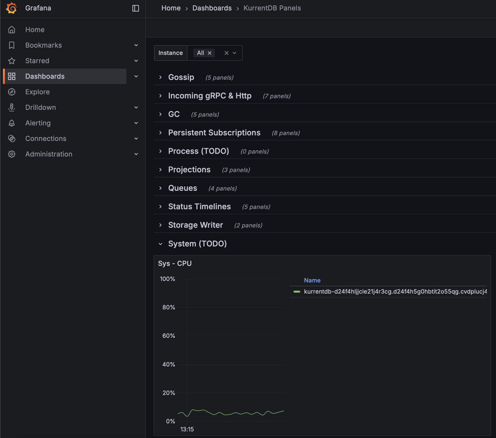
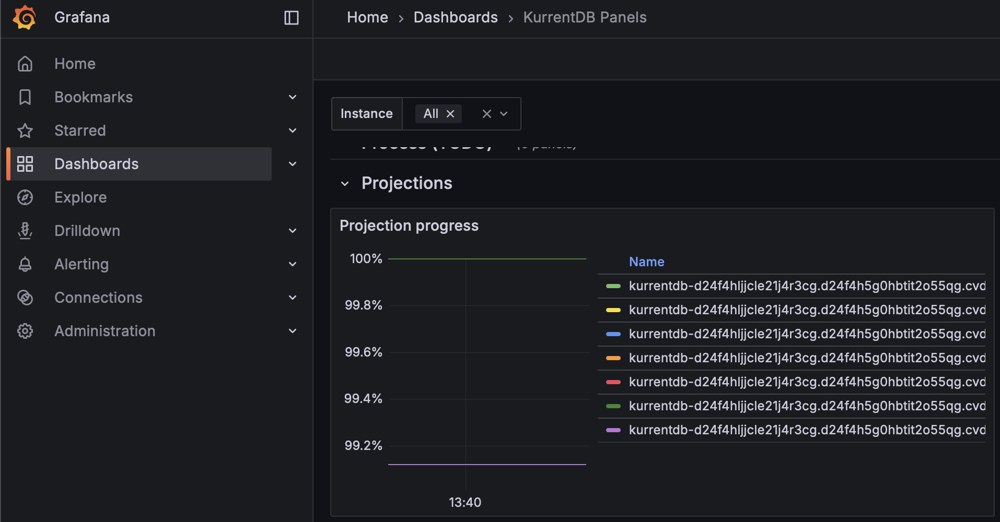
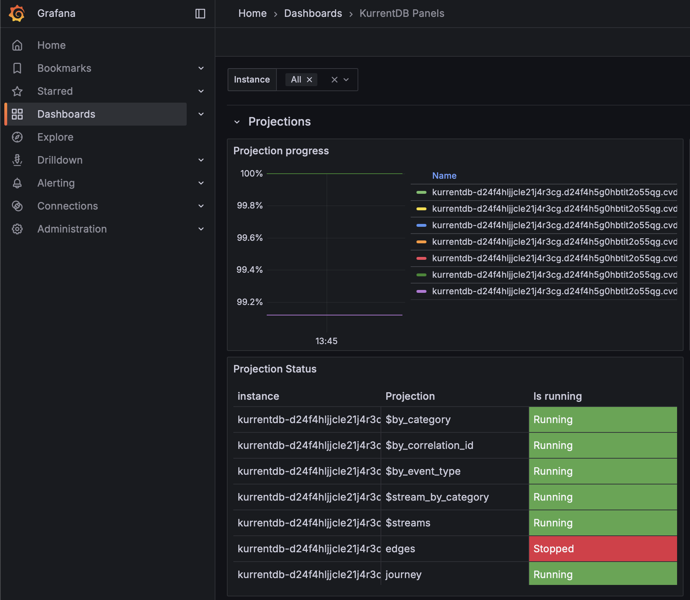
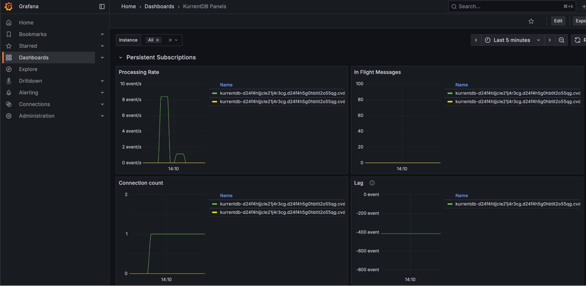
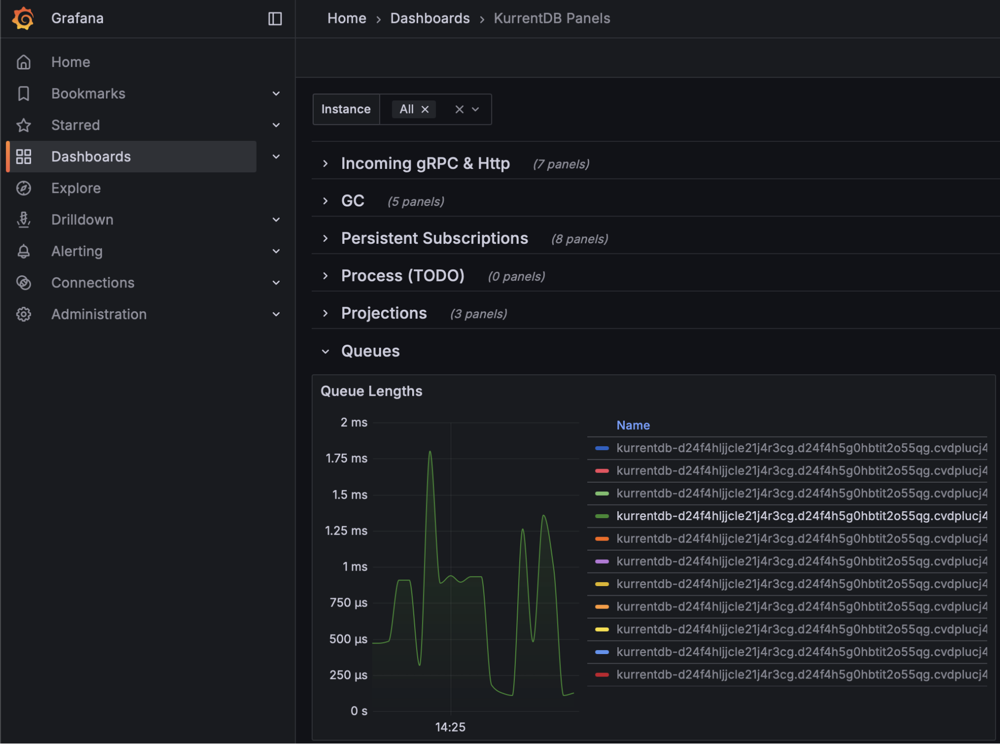
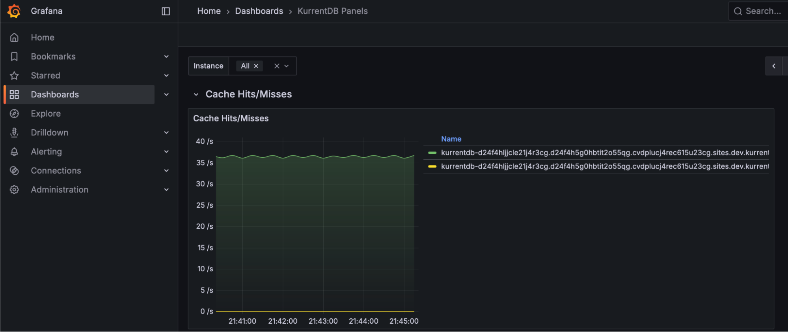
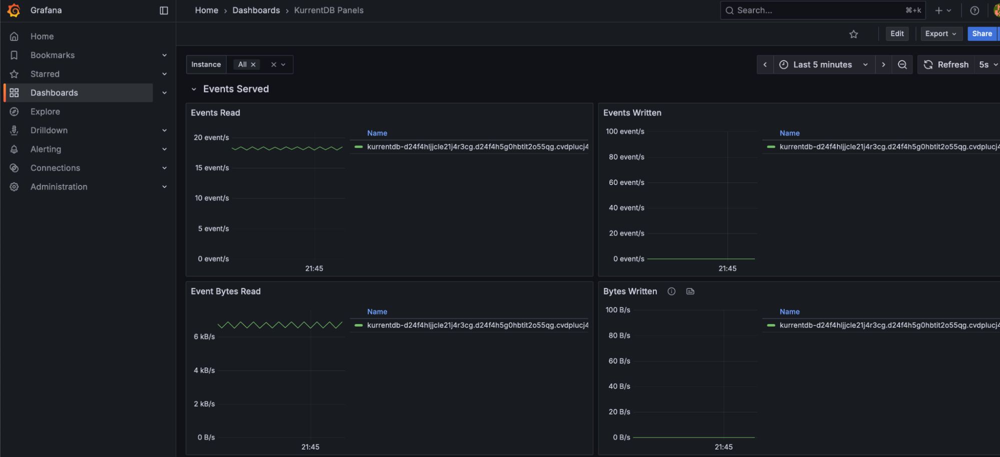
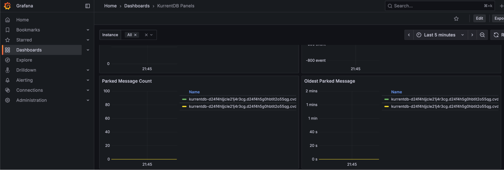
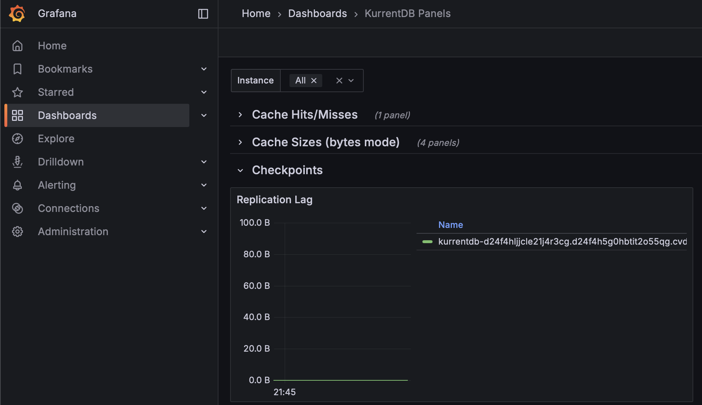
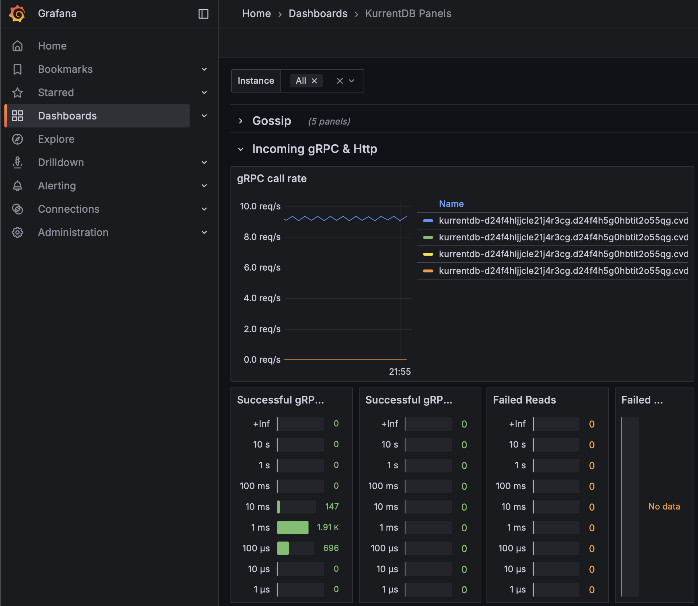

# Monitoring Best Practices

## Background

When monitoring the health of a KurrentDB cluster, one should investigate and alert on multiple factors. Here we discuss those in detail

## Metrics-based Monitoring

The items in this section may be monitored using metrics from KurrentDB's Prometheus endpoint / Grafana dashboard, or via metrics from the operating system / machine / cloud provider

### IOPS

One should **monitor IOPS usage** to ensure it does not increase over 80% of allocation. This should take place at the operating system or machine level

One should also **evaluate IOPS bursts** during extremely heavy periods, start of day / week, etc. to ensure they do not cause exhaustion. This should take place at the operating system or machine level

Finally, **monitoring reader queue lengths** would help organizations understand if IOPS are exhausted as those queues will continue to grow in length, meaning the server never catches up with all read requests. This should take place using Kurrent's Grafana Dashboard


**At the first signs of IOPS exhaustion**, customers are advised to increase their IOPS limits

### Memory Utilization

As a database, we seek to use memory efficiently for improved processing. Organizations should perform a memory capacity confirmation test to establish baseline utilization, and monitoring should be performed to look for deviations from this baseline

Further, monitoring at the operating system level to ensure that **memory utilization does not exceed 85% of physical memory** mitigates allocation exceptions

### Garbage Collection Pauses

Garbage collection monitoring largely is concerned with gen2 memory, where longer-lived objects are allocated. The length of **application pauses for compacting garbage collection** of this generation should be monitored using the Kurrent Grafana Dashboard. Steadily increasing durations may eventually cause a leader election as the database will be unresponsive to heartbeats during compacting garbage collections. Monitor this metric to be below the configured Heartbeat Timeout value (default is 10 seconds, so for most customers, 8 seconds should be appropriate)


**To mitigate the impact of compacting garbage collection**, KurrentDB 25.1 and above automatically uses the ServerGC algorithm. If you are using a version of KurrentDB below 25.1, it can be enabled with the following environment variables:

* DOTNET\_gcServer set to 1  
* DOTNET\_GCHeapHardLimitPercent set to 3C (which is 60 in HEX)

On startup, KurrentDB will log that it is using ServerGC:

```
[64940, 1,07:15:04.489,INF] EventStore                     GC:                       3 GENERATIONS IsServerGC: True Latency Mode: Interactive
```

### CPU Utilization

To avoid thrashing, monitor **sustained CPU utilization remains below 80%**. This can be done at the operating system level, or on the Kurrent Grafana Dashboard



### Disk Utilization

Kurrent recommends that organizations configure log, data, and index disk locations separately to avoid one impacting the other. Monitoring of these spaces should be at the operating system level. Ensure that **log and data disk utilizations are under 90%**. **Index disk utilization should be under 40%**, as additional disk space is required when performing index merges

### Projection Progress

Organizations should monitor the Kurrent Grafana Dashboard to ensure that the **Projection Progress is close to or at 100%** for each projection. This ensures that projections are not falling behind, and keeping pace with appends to the database



If your **Projection Progress is decreasing, contact Kurrent Support** for analysis and recommendations to mitigate

NOTE: On large databases, this metric could show as 100% but still in fact be far behind due to the number of significant digits when dividing large numbers

### Stopped Projections

**Stopped projections do not execute**, and should be monitored to ensure all components of your database are operational. Use the Kurrent Grafana Dashboard to see which projections are stopped, investigate the cause, and resolve



### Persistent Subscription Lag

To ensure timely delivery of events to subscribers, we monitor Persistent Subscription Lag through the Kurrent Grafana Dashboard. **Persistent Subscription Lag should be as close to 0 as possible** to ensure that persistent subscriptions are caught up and checkpointed



### Queue Times

Queue Times tell an organization how long an item is waiting to be processed. There are several queues, including Reader, Worker, Projection, Subscription, and more. Queue times should be monitored using the Kurrent Grafana Dashboard, ideally maintaining **steady queue times with no large spikes or upward trend**



If your queue times are increasing, it may be a sign that your hardware is undersized

### Cache Hit Ratio

KurrentDB maintains internal caches of stream names to speed up reads and writes. Use the Kurrent Grafana Dashboard to monitor **Cache Hit Ratio, and aim for a value of 80% or above** to ensure the right stream pointers are kept in memory for streams currently being read / written



If your Cache Hit Ratio is below 80%, or declining, consider increasing the **StreamInfoCacheCapacity** configuration parameter to keep more streams in memory. Be aware that this can increase memory usage and GC pauses.

### Bytes Read and Bytes Written

**Bytes Read and Bytes Written metrics should be relatively even during regular processing**, with few spikes indicating irregular load. Spikes in load may be indicative of upstream or downstream application issues, and cause uneven performance. NOTE: these spikes may also be innocuous and part of regular business process load changes



### Persistent Subscription Parked Messages

The Kurrent Grafana Dashboard reports the number of **Persistent Subscription Parked Messages, which may indicate processing or logic errors** in persistent subscribers. This value should be as close to 0 as possible



NOTE: These are events that cannot be handled by the application's logic, and should be reported to the team responsible for application development for appropriate handling and resolution. These events can be replayed or deleted through the Kurrent Web UI or API, if required. 

### Node Status

Each cluster needs a Leader and Followers. The Kurrent Grafana Summary dashboard can show, at a glance, the status of each node in the cluster. Organizations should monitor to **make sure there is always one leader, and two followers, available** (for a 3 node cluster). The cluster will function correctly with only two nodes, but the situation should be rectified since with only two nodes available a further failure would cause an outage.


### Replication Lag

In a cluster, events are always appended to the leader, and replicated to the follower nodes. **Replication Lag between the leader and followers should be close to 0 bytes**, and not increasing over time. Organizations should monitor the Kurrent Grafana dashboard Replication Lag and alert if this value is increasing as it is a sign that a follower is unable to keep up with the leader. When a node is restored from a backup, it will have a replication lag while it catches up. The lag should diminish to 0 over time.



### Failed gRPC Calls

Failed gRPC calls can be monitored on the Kurrent Grafana dashboard, and indicate that a connection or database operation failed. **Ideally, there are 0 failed gRPC operations of any kind**, and failure could be indicative of a number of conditions from network issues, client issues, etc.



## Log-based Monitoring

These items appear in the KurrentDB log files

### Projection State Size

The **maximum projection state size is 16 MB**. Projection states that exceed this size will fail to checkpoint and enter a faulted state. Once the projection state reaches 8 MB in size \- 50% of the limit \- the server will begin logging messages such as the following:

```
"messageTmpl": "Checkpoint size for the Projection {projectionName} is greater than 8 MB. Checkpoint size for a projection should be less than 16 MB. Current checkpoint size for Projection {projectionName} is {stateSize} MB."
```

Customers should alert on this log message, and reduce the size of the Projection state as quickly as possible to avoid exceeding the maximum. In newer versions of KurrentDB this can be monitored in the metrics \- see later in this document.

### Long Index Merge

While not directly a cause for concern, organizations may wish to **monitor the duration of index merges to ensure their regular maintenance scripts are completing during scheduled windows**, and not impacting performance of their solutions. Index merge times are logged with messages such as the following:

```
"PTables merge finished in 15:32:13.5846974 ([128000257, 128000194, 128000135, 128000181, 128000211, 46303330995] entries merged into 46943331973)."
```

### Cluster Node Version Mismatch

Except during rolling upgrades, **cluster nodes should be running the exact same version of KurrentDB**. If they are not, the servers will log this as an error state that should be corrected, with messages such as the following:

```json
{
	"@t": "2024-04-08T12:15:53.1465960+01:00",
	"@mt": "MULTIPLE ES VERSIONS ON CLUSTER NODES FOUND [ (Unspecified/node0.acme.com:2112,24.2.0), (Unspecified/node4.acme.com:2112,23.10.0.0), (Unspecified/node3.acme.com:2112,23.10.0.0), (Unspecified/node2.acme.com:2112,23.10.0.0), (Unspecified/node1.acme.com:2112,23.10.0.0) ]",
	"@l": "Warning",
	"@i": 498346887,
	"SourceContext": "EventStore.Core.Services.Gossip.ClusterMultipleVersionsLogger",
	"ProcessId": 77265,
	"ThreadId": 17
}
```

### Certificate Expiration Warnings

**When SSL Certificates are expiring soon, cluster nodes will log a warning**. Organization should alert on this warning to ensure that certificates are renewed before expiration to avoid communication failures and cluster-down scenarios. Messages such as the following are logged:

```json
{
	"@t": "2024-10-13T02:43:38.9403418+00:00",
	"@mt": "Certificates are going to expire in {daysUntilExpiry:N1} days",
	"@r": [
		"9.6"
	],
	"@l": "Warning",
	"@i": 40508766706,
	"daysUntilExpiry": 9.602558584001157,
	"SourceContext": "EventStore.Core.ClusterVNode",
	"ProcessId": 88375,
	"ThreadId": 21
}
```

## General Health Tips

Below we present some general health tips

### Scavenge Regularly

Scavenging removes deleted events and streams, and should be done regularly. Not scavenging or not removing a significant amount of data is not, however, an indicator of poor cluster health. Log entries do report how much space was reclaimed from scavenging, and can in fact be a negative number if the scavenging activity did not remove a large number of events.

```json
{
	"@host": "cbcns65o0aek8srtnlsg-1.mesdb.eventstore.cloud",
	"@i": 211285875,
	"ProcessId": 3870715,
	"ScavengeId": "f8f18dd4-2db7-4785-ac30-03c5fa30c8d7",
	"SourceContext": "EventStore.Core.Services.Storage.StorageScavenger",
	"ThreadId": 54,
	"elapsed": "40.08:40:28.6613320",
	"messageTmpl": "SCAVENGING: Scavenge Completed. Total time taken: {elapsed}. Total space saved: {spaceSaved}.",
	"spaceSaved": -11710416
}
```

### Install Patch versions

Kurrent will release patch versions from time to time that contain important fixes. It is strongly recommended to keep up to date with the most recent patch version

### Few Errors / Warnings

During normal operation, KurrentDB produces few errors or warnings. Logs should generally be clean. Customers may wish to monitor for spikes in the error / warning rates emitted into log files

### KurrentDB Health Endpoint

When a KurrentDB node is alive and healthy, it returns a response document at the following URL: https://localhost:2113/health/live?liveCode=200

## Conclusion

In this document, we have presented metrics and log entries to monitor, along with some general tips and forward looking metrics

## Further Reading

Please see the following Kurrent Academy resources for more information

* Optimizing KurrentDB: [https://academy.kurrent.io/course/optimizing-kurrentdb](https://academy.kurrent.io/course/optimizing-kurrentdb)   
* KurrentDB Operations Courses: [https://academy.kurrent.io/operations-courses](https://academy.kurrent.io/operations-courses)   
* KurrentDB Diagnostics: [https://docs.kurrent.io/server/latest/diagnostics/](https://docs.kurrent.io/server/latest/diagnostics/) 