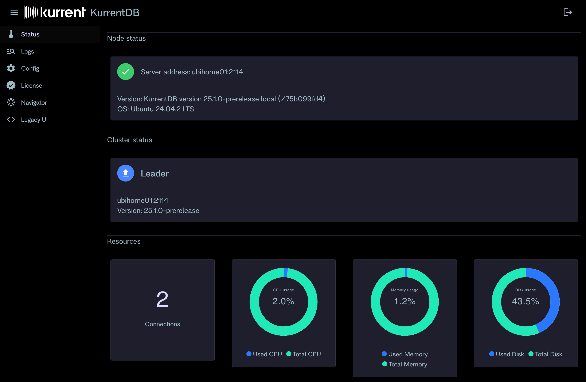
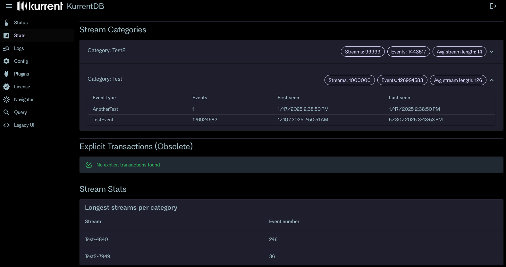
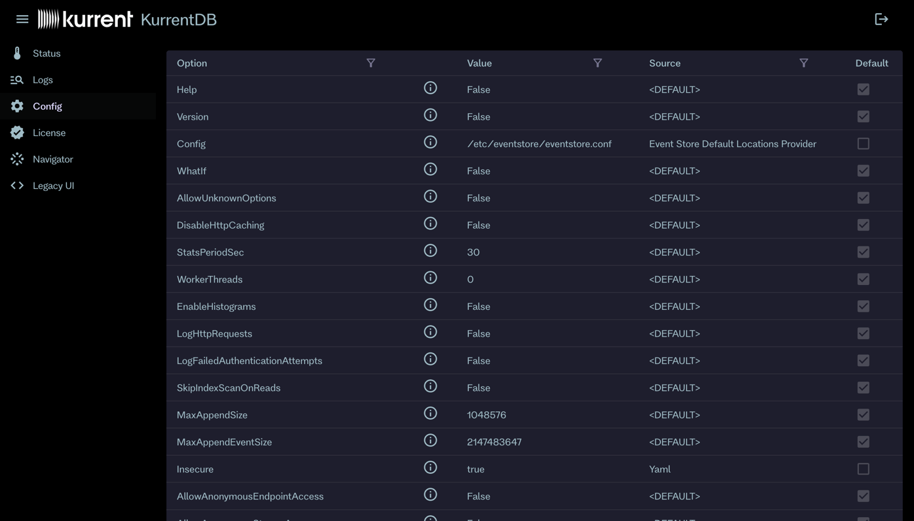

# Embedded Web UI

The KurrentDB embedded UI is available at _SERVER_IP:2113_ and helps you interact with and visually manage a cluster. This guide explains the interface's tabs and their functions.

::: tip
The legacy KurrentDB web interface (`/web`) is reaching its end of life. In the future, the legacy UI functionality will be split between the new embedded UI (available since V25.0) and Kurrent Navigator. You can try using the Preview version of [Kurrent Navigator](https://navigator.kurrent.io/) app today. It doesn't have full feature parity with the legacy web UI, but it already has usability improvements compared to it.
:::

## Embedded UI

The new embedded UI shows the cluster status and resources utilization, as well as some useful metrics about throughput of data being put to and read from the database. In addition, it shows some useful information about the cluster node like its configuration, license status, and more.

### Dashboard

The dashboard is the embedded UI entry point. There, you find the following information:
- **Cluster status**: Shows the cluster status and the number of nodes in the cluster.
- **Cluster nodes**: Shows the list of nodes in the cluster and their status.
- **Node resources**: Shows the node resources utilization, including CPU, memory, and disk usage.
- **Node metrics**: <Badge type="info" vertical="middle" text="License Required"/> Shows the node metrics, including the number of events written, read, and the number of open connections.

### Database stats

<Badge type="info" vertical="middle" text="License Required"/>

When [secondary indexes](../features/indexes/secondary.md) are enabled, the _Stats_ page shows additional information about the database, including:
- **Stream categories**: Shows stream categories in the database with additional information such as:
    - **Event types**: Event types per stream category with number of events per event type, as well as earliest and latest event timestamps.
    - **Streams**: Number of streams per stream category
    - **Events**: Number of events per stream category
    - **Avg. stream length**: Average stream length per stream category
- **Explicit transactions**: Shows if the database has event records that are part of explicit transactions, with the number of explicit transactions found. Explicit transactions feature is deprecated and not supported by the current client APIs.
- **Stream stats**: Shows the longest stream per category.

### Logs

<Badge type="info" vertical="middle" text="License Required"/>

The _Logs_ section shows the recent log messages of the cluster node. It's possible to filter log messages by log level and message content. The logs are streamed to the UI in real-time, so you can see the latest log messages as they are generated. The log stream starts at the moment you open the page, and there's no option to find olg logs on that page.

Use the _Logs_ page to observe the cluster node's activity and troubleshoot any issues that may arise.

### Configuration

<Badge type="info" vertical="middle" text="License Required"/>

On the _Configuration_ page, you can view the current configuration of the cluster node. The configuration is displayed in a tabular format, and you can filter options by name, value, and source. The page shows description for each option, its current value, and the source from which it was set (e.g., default, environment variable, or configuration file).

The configuration is read-only, and you cannot modify it from the UI.

### Plugins

<Badge type="info" vertical="middle" text="License Required"/>

The _Plugins_ page shows the list of plugins and subsystems loaded in the cluster node. For each plugin, you can see its name, version, and description. It allows you to easily verify which plugins are active in the cluster node.

### Other Pages

Other pages of the embedded UI are:
- **License**: Shows the license status of the cluster node. You can view the license type, expiration date, and other details.
- **Navigator**: Has a link to the Kurrent Navigator app download page, where you can also find supported features table in comparison with the legacy admin UI.
- **Legacy UI**: Has a link to the legacy web UI, which is still available for now. The legacy UI will be deprecated in the future, and you should use the new embedded UI or Kurrent Navigator instead.

## Legacy UI

The legacy web UI is available at _SERVER_IP:2113/web_ and helps you interact with and visually manage a cluster, as well as browse the data. This guide explains the interface's tabs and their functions.

You can also open the legacy UI by clicking the _Legacy UI_ link of the new embedded UI sidebar.

### Dashboard

In the legacy webUI, the _Dashboard_ tab shows an overview of active queues with associated statistics in the top half. The _+_ icon indicates a queue group; click it to reveal the queues in that group.

The second half of the tab shows active connections to KurrentDB and information about them.

Click the _Snapshot_ button in the top right to output a snapshot of all queue statistics at the time you clicked the button.

### Stream browser

The _Stream Browser_ tab gives an overview of recently created and changed streams, clicking on an individual stream shows details about the individual stream.

#### Event stream

Each stream shows pages of the events in a stream with an overview of the event. Click the _Name_ to see the EventId, and _JSON_ to see the event data. The buttons above change depending on what you are viewing in the interface. The _Back_ button takes you to the parent screen.

The buttons on the top right when you are viewing an event stream are:

- _Pause_: Stop showing events arriving into this stream.
- _Resume_: Resume showing events arriving into this stream.
- _Edit ACL_: Edit [the access control lists](../security/user-authorization.md#access-control-lists) for a stream.
- _Add Event_: [Add a new event](@clients/grpc/appending-events.md) to the stream.
- _Delete_: [Delete a stream](@clients/grpc/delete-stream.md#soft-delete) to the stream.
- _Query_:

The buttons on the left above the events when you are viewing an event stream are:

- _self_: Takes you to the overview of the stream.
- _first_: Takes you to the first page of events in a stream.
- _previous_: Takes you to the previous page of events in a stream.
- _metadata_: Shows the metadata of a stream.
  - On the metadata screen, click _Add New Like This_ to add a new event to the stream.

### Projections

The _Projections_ tab shows system and user-created projections defined in KurrentDB. The buttons above the list do the following:

- _Disable All_: Disable all running projections.
- _Enable All_: Enable all stopped projections.
- _Include Queries_: Toggle displaying queries in the Projections table.
- _New Projection_: [Create a user-defined projection](projections/custom.md) with the Admin UI.

Clicking an individual projection shows further details.

On the left is the projection definition. On the right are the stats, results, and projection state. The buttons above the details do the following:

- _Start_: Start a stopped projection.
- _Stop_: Stop a running projection.
- _Edit_: Edit the projection definition.
- _Config_: [Set configuration options](projections/custom.md#configuring-projections) for a projection.
- _Debug_: Opens [the debugging interface](projections/custom.md#debugging) to debug what effect a projection has on events.
- _Delete_: Delete a projection.
- _Reset_: Reset a projection.
- _Back_: Returns you to the parent screen.

### Query

The _Query_ tab has a code editor field where you can create transient and short-lived projections to analyze your event streams quickly.

### Persistent subscriptions

The _Persistent Subscriptions_ tab shows an overview of [persistent subscriptions](persistent-subscriptions.md) configured on streams. The button above the list does the following:

- _New Subscription_: Create a new subscription.

Clicking the _+_ icon next to a stream name reveals the subscription name and more buttons. The _Back_ button takes you to the parent screen.

- _Edit_: Edit the subscription.
- _Delete_: Delete the subscription.
- _Detail_: Shows the subscription configuration options.
- _Replay Parked Messages_: Replay events in subscription to return state.

### Admin

The _Admin_ tab shows subsystems enabled (currently only [projections](projections/README.md)) on KurrentDB and [scavenges](../operations/scavenge.md) run. You can start a new scavenge operation by clicking the _Scavenge_ button, and shut KurrentDB down by clicking the _Shutdown Server_ button.

### Users

The _Users_ tab shows [the users defined in KurrentDB](../security/user-authentication.md). Clicking an individual user displays a JSON representation of that user's details.

### Log out

Logs you out of the Admin UI interface.
