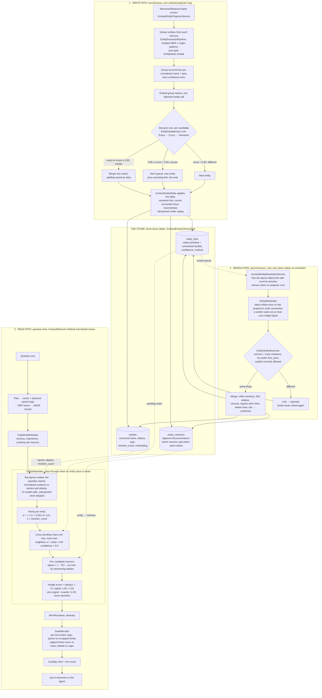

# Entity memory, end to end

Three pipelines: a synchronous write path that only takes cheap, high-confidence identity decisions, an offline resolution channel for everything it deferred, and a read path that prices unresolved doubt in so deferring stays safe. Node names match the classes.

Worked example: "Emilia Chen" arrives, scores 0.84 against Emily Chen. Too close to ignore, not enough to merge, so both entries exist joined by a pending note. A question naming Emily pushes Emily's memories at ×1.10 and, across the note, Emilia's at ×1.042 (1 + 0.1 · (1.0 × 0.84 × 0.5)). The doubt costs almost nothing while it waits. Later a human confirms the typo through the resolution service and the entries merge for good, with "emilia chen" kept as an alias so the next occurrence resolves exactly, for free.

## Where each stage lives

| Stage | Code |
|---|---|
| Projector loop | `KontextEntityProjectorService.cs` |
| Extraction cascade | `Extraction/` (`EntityExtractionPipeline`, `CatalystEntityExtractor`, `PatternEntityExtractor`, `EntityName`) |
| Grouping, embedding, branch handling | `KontextEntityProjection.cs` |
| Decision rule, thresholds | `Resolution/EntityDeduplicator.cs` over `ExactEntityResolver`, `FuzzyEntityResolver`, `SemanticEntityResolver` |
| Batch writer | `Data/KontextEntityWriter.cs` |
| Tables, indexes | `KontextEntitySchemaTask` (v2 of the migration stream, `../../KontextSchema.cs`) |
| Store reads | `Data/KontextEntityStore.cs` |
| Resolution surface | `Resolution/KontextEntityResolutionService.cs` |
| Projector/resolution serialization | `Resolution/EntityWriteGate.cs` |
| Verdict executor | `Resolution/EntityVerdictExecutor.cs` |
| Read chain | `../../../Kurrent.Kontext.Retrieval/KontextRetriever.cs` |
| Entity nudge stage | `../../../Kurrent.Kontext.Retrieval/Stages/EntityModulator.cs`, port `../../../Kurrent.Kontext.Retrieval/Search/IEntityIndex.cs`, adapter `KontextEntityIndex.cs` |
| Seat caps | `../../../Kurrent.Kontext.Retrieval/Stages/SeatAllocator.cs` |
