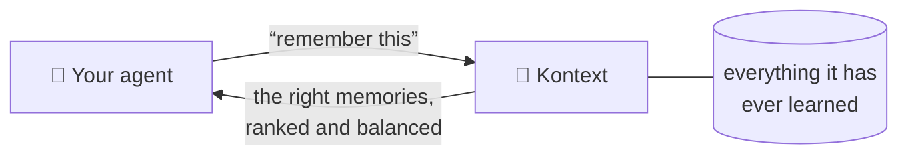
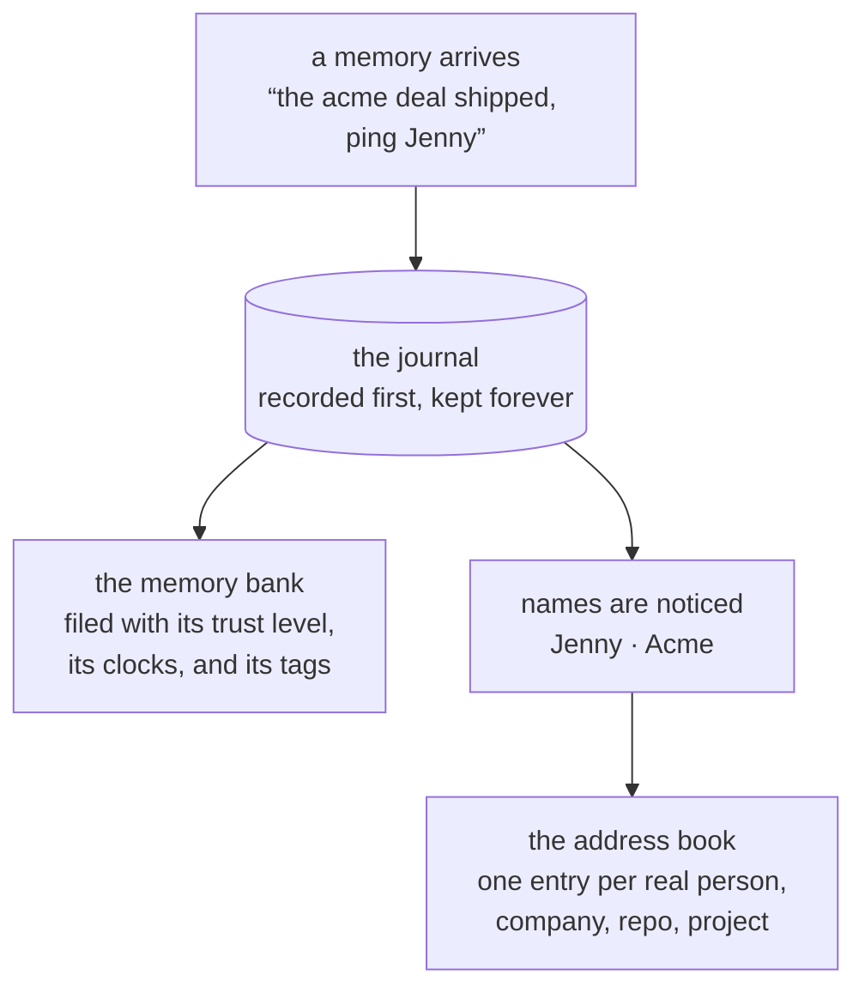
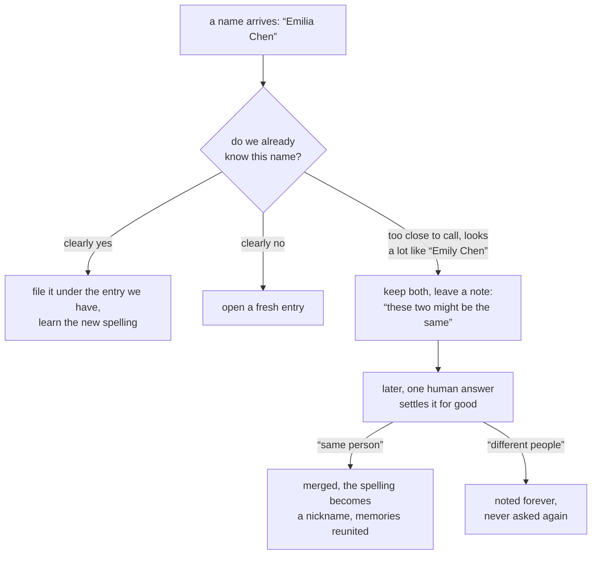
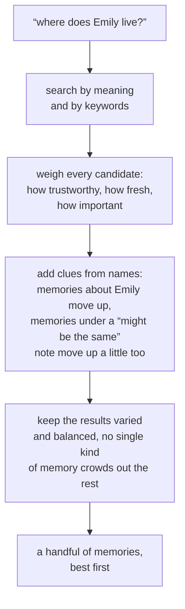
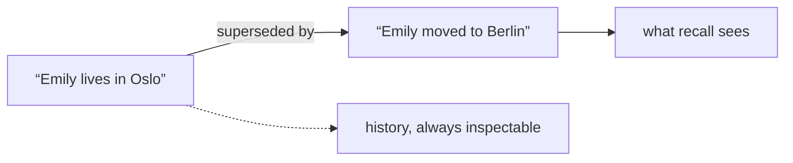

# Kurrent Kontext

Long-term memory for AI agents.

An agent connected to Kontext remembers what it learned yesterday, knows who and what those memories are about, and gets back exactly the few memories that matter when it asks.

## Six verbs

The whole surface is six verbs, spoken over MCP or gRPC:

| Verb | What it does |
|---|---|
| **retain** | save something worth remembering |
| **recall** | ask a question, get the most relevant memories back |
| **reclaim** | fetch specific memories by id |
| **recollect** | browse the memory bank, filtered and sorted |
| **retract** | take something back, along with everything built on it |
| **reflect** | distill many memories into fewer, better ones |

## What happens when it remembers

Every memory is written to a permanent journal before anything else. The organized views are built from that journal, so they can always be rebuilt, audited, or replayed.

Each memory carries three things that matter later:

- **A kind that doubles as a trust level.** Something the agent saw happen outranks something it was told. A rumor is welcome, but it is stored as a rumor and ranked as one.
- **Three clocks.** When it happened, when it was saved, and when it last proved useful. Memories that keep being useful stay fresh, memories that never help fade quietly.
- **Tags for scope.** This user, this repo, this project. Ask within a scope and other scopes stay out of the way.

## The address book, and honest doubt

Kontext keeps one entry per real thing and files every memory under the entries it mentions. The interesting part is what happens when it is not sure.

Merging two entries can never be undone, so Kontext refuses to guess at save time, when it has the least evidence it will ever have. It keeps both entries, leaves a note, and moves on. One human answer later fixes memory permanently, and the same question is never asked twice.

## What happens when you ask

The doubt notes earn their keep here. Memories filed under a maybe-the-same name still reach you, just at reduced strength. If the doubt was justified you lost nothing, and if it wasn't, the weak push fades against real answers. Unresolved doubt costs almost nothing while it waits.

## Nothing is silently lost

- New knowledge **supersedes** the old. The fresh version answers questions, the old one stays underneath as history.
- **Retracting** a memory hides it and everything derived from it, but it can still be inspected on request.
- The journal keeps every event, so the entire memory can be rebuilt from scratch at any time.

Kontext runs on KurrentDB. The journal is a real event log, not a metaphor.
